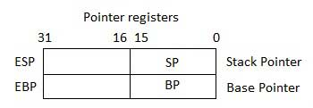
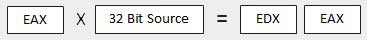

# Assembly Programming သင်ခန်းစာ

Assembly Prgramming Language က low-level progamming language ဖြစ်ပါတယ်။ Assembly language ကို NASM, MASM, ...etc စတဲ့ assembler နဲ့ mechine code အဖြစ်ပြောင်းပြီး run ရတာပါ။

## ဘယ်သူတွေအတွက်လည်း?

ဒီသင်ခန်းစာက Assembly programming ကိုအခြေခံမှစပြီး လေ့လာလိုသူတွေအတွက် ဖြစ်ပါတယ်။ ဒီသင်ခန်းစာက သင့်အား assembly programming ကို ကျွမ်းကျင်တဲ့အဆင့်အထိ နားလည်ဖို့ လုံလောက်တဲ့အထိ ပေးစွမ်းနိုင်ပါတယ်။

## ဘာတွေလိုလဲ?

ဒီသင်ခန်းစာတွေကို မဆောက်ရွက်ခင် သင့်အနေနဲ့ Computer Programming ရဲ့ ပညာရပ်ဝေါဟာရ တွေကို နားလည်ထားရပါမယ်။ အခြား programming language တစ်ခုခုကို သင်တတ်မြောက်ထားခဲ့ရင် ဒီ Assembly programming ရဲ့ concepts ကိုသင်ယူရာမှာ အထောက်အကူပြုပြီး မြန်မြန်ဆန်ဆန် နားလည်သဘောပေါက်လွယ်ပါလိမ့်မယ်။

# Introduction

## Assembly Language ဆိုတာဘာလဲ?

Personal Computer (PC) တိုင်းမှာ microprocessor ရှိပါတယ်။ အဲဒီ microprcessor က ကွန်ပျူတာကို အတွက်အချက်များ (arthmetcal)၊ logical နဲ့ ထိမ်းချုပ်ခြင်းများ (control actvities) ကို ဆောင်ရွက်ပေးပါတယ်။

prosessor မူကွဲတိုင်းမှာ အမျိုးမျိုးသောလုပ်ဆောက်ချက် (operations) များကို ဆောင်ရွက်ဖို့ သူတို့ကိုယ်ပိုင် ညွှန်ကြားချက်အစု (set of instruction) များရှိပါတယ်။ ကီးဘုတ်ကနေ input တွေကို ရယူတာမျိုး၊ ချက်အလက်တွေကို screen မှာပြပေးတာမျိုး နှင့် အခြားလုပ်ငန်းဆောင်တာတွေ ဆောင်ရွက်တာမျိုးစတဲ့ operations တွေဖြစ်ပါတယ်။ အဲဒီ set of instructions တွေကို "mechine language instructions" များလို့ခေါ်ပါတယ်။

processor တွေက 1 နဲ 0 တွေသာပါဝင်တဲ့ string ဖြစ်တဲ့ mechine language instructions များကိုသာနားလည်နိုင်ပါတယ်။ software developement မှာ mechine language တွေကိုသာ တိုက်ရိုက်ရေးနေရရင်် နားလည်ရခက်ပြီး ရှုတ်ထွေးကုန်မှာ မလွဲမသွေပါ။ ဒီတော့ low-level assembly language က specific family of processor တွေအတွက် instruction တွေကို symbolic code တွေနဲ့ ကိုယ်စားပြုပေးထားအတွက် ပိုပြီးတော့လွယ်ကူစွာနားလည်နိုင်စေပါတယ်။

## Assembly Language ရဲ့အကျိုးကျေးဇူးများ

Assembly Language ကိုနားလည်ထားခြင်းအားဖြင့် -

* programs တွေက OS၊ processor၊ BIOS တို့နှင့် မည်သို့ဆက်သွယ်လဲ?။
* အချက်အလက် data တွေက မှတ်ဉာဏ်နှင့် အခြား external devices ကိုမည်သို့ ကိုစားပြုပေးလဲ။
* prosessor က executes instruction တွေကိုဘယ်လို ရယူလဲ?။
* instruction တွေကို ဘယ်လို ရယူပြီး data တွေကို ဘယ်လို process လုပ်လဲ။
* program တစ်ခုက external devices တွေကို ဘယ်လိုဝင်ရောက်လဲ?

စတာတွေကို နားလည်သဘောပေါက်မည့်အပြင်၊ အခြား သူ့ကိုအသုံးပြုခြင်းဖြင့်ရရှိမည့် အကျိုးကျေးဇူးတွေကတော့ -

* execution time နဲ့ memory အသုံးပြုမှု နည်းသည်ထက်နည်းစေမယ်။
* hardware-specific တွေရဲ့ ရှုတ်ထွေးတဲ့ အလုပ်များကို ပိုပြီးလွယ်ကူအောင် ဆောင်ရွက်စေမယ်။
* time-critical jobs တွေအတွက် သင့်တော် ပါတယ်။
* writing interrupt service routines နဲ့ other memory resident programs တွေအတွက် ပိုပြီးသင့်တော်စေပါတယ်။

## PC Hardware တွေရဲ အခြေခံ အင်္ဂါရပ်များ

PC တစ်လုံးမှာ အဓီကကြတဲ့ hardwares တွေကတော့ processor, memory နဲ့ registers တို့ဖြစ်ပါတယ်။ registers တွေက processor ရဲ့ အစိတ်အပိုင်းတွေဖြစ်ပြီး data နဲ့ address တွေကို ကိုင်ဆောင်ထားပါတယ်။ program တစ်ခုကို execute လုပ်ဖို့အတွက် အဲဒီ program ကို exteral device ကနေပြီးတော့ internal memory ထဲသို့ system ကကူးထည့်ပေးရပါတယ်။ processor က program instruction ကို execute လုပ်ပါတယ်။

ကွန်ပျူတာရဲ့ အခြေခံမှတ်ဉာဏ်သိုမှီပုံ ယူနစ်က bit တစ်ခုဖြစ်ဖြစ်ပါတယ်။ သူက ON(1) သို့မဟုတ် OFF(0)တစ်ခုခုဖြစ်နေပါမယ်။ ပြီးတော့ bit (၈)ခုပါတဲ့ အုပ်စုတစ်ခုကို byte လို့ခေါ်ပြီး ဒီကနေ့ခောတ်ကွန်ပျူတာတွေမှာာ အသုံးများပါတယ်။  

ဒီတော့ piraty bit က မကိန်း byte တစ်ခုမှာ bit တွေရဲ့ အရေအတွက်လုပ်ဖို့ သုံးပါတယ်။ parity က စုံကိန်းဖြစ်နေလျှင် system က  hardware မှာ မှားယွင်းမှုရှိနေသည် (သို့မဟုတ်) လျှပ်စစ်အနှောက်အယှက်တစ်ခုဖြစ်နေသည် ဟုသော parity error (ဖြစ်မှုရှားပါပါသည်) ဖြစ်နေသည်ဟုယူဆ လိမ့်မည်။

processor ကအောက်ပါ data size များကိုထောက်ပံပေးနိုင်ပေးနိုင်ပါသည်။

* Word: a 2-byte data item
* Doubleword: a 4-byte (32 bit) data item
* Quadword: an 8-byte (64 bit) data item
* Paragraph: a 16-byte (128 bit) area
* Kilobyte: 1024 bytes
* Megabyte: 1, 048, 576 bytes

## Binary Number System

ကိန်းဂဏန်းစနစ်တိုင်းက postional notation ကိုအသုံးပြုပါတယ်။ ဆိုလိုသည်မှာ ကိန်းတစ်လုံးရဲ့ position တိုင်းက မတူကွဲပြားတဲ့ positional တန်ဖိုးတွေကို ဖော်ပြနေပါတယ်။ position တိုင်းက အခြေရဲ့ ထပ်ညွှန်းကိန်း ဖြစ်ပါတယ်၊ binary number system မှာ 2 ကအခြေကိန်း ဖြစ်ပါတယ် ၊ပြီးတော့ ထပ်ညွှန်းကိန်းတွေက position အလိုက် 0 ကနေစပြီးတော့ 1 တိုးတိုးသွားပါတယ်။ 

အောက်ပါဇယားကတော့  8 bit binary number တစ်ခုရဲ့ positional value တွေကိုဖော်ပြပေးထားတာပါ။ bit အားလုံးကို ON (1)သတ်မှတ်ပေးထားပါတယ်။

|  |  |  |  |  |  |  |  |  |
| -- | :--: | :--: | :--: | :--: | :--: | :--: | :--: | :--: |
| __Bit value__ | 1 | 1 | 1 | 1 | 1 | 1 | 1 | 1 |
| __Position value as <br> a power of base 2__ | 128 | 64 | 32 | 16 | 8 | 4 | 2 | 1 |
| __Bit number__ | 7 | 6 | 5 | 4 | 3 | 2 | 1 | 0 |

binary number တစ်ခုရဲ့တန်ဖိုးက လက်ရှိ ရောက်နေတဲ့ bit ရဲ့ အခြေအနေ နဲ့ သူရောက်နေတဲ့ positional value ပေါ်မှာ အခြေခံပါတယ်။ 
ဒီတော့ အထက်ပါ ဇယားမှာရှိတဲ့ binary number ရဲ့ တန်ဖိုးက -

1 + 2 + 4 + 8 + 16 + 32 + 64 + 128 = 255

အဲတာက 2<sup>8</sup> - 1 နဲ့ တူပါတယ်။

## Hexadecimal Number System

hexadecimal number system ကတော့ အခြေ 16 အသုံးပြုပါတယ်။ ထိုစနစ်မှာရှိတဲ့ ကိန်းတွေရဲ့ range က 0 ကနေ 15 အထိရှိပါတယ်။ 10 ကနေ 15 အထိ ကိန်းတွေကို A ကနေ F အထိ စာလုံးတွေနဲ့အစားထိုးပြီး ကိုစားပြုပေးလိုက်ပါတယ်။ 

computing မှာ hexadecimal ကိန်းတွေကိုအသုံးပြုရခြင်းအကြောင်းက ရှည်လျားတဲ့ binary representaions တွေကို ချုံ့ခြင်လို့ဖြစ်ပါတယ်။ အခြေခံအားဖြင့် hexadecimal  number system က binary data တစ်ခုကို byte တစ်ခုခြင်းစီကို တစ်ဝက် (half) ဖြစ်စားပြီး half-byte တစ်ခုခြင်းစီရဲ့ တန်ဖိုးတွေနဲ့ ဖော်ပြခြင်း အားဖြင့် ကိုစားပြုပါတယ်။ အောက်ပါ ဇယားက decimal, binary, နဲ့ hexadecimal တွေရဲ့ တူညီတန်ဖိုးတွေကို ဖော်ပြပေးထားတာ ဖြစ်ပါတယ်။

| Decimal number | Binary representation| Hexadecimal representation |
| :--: | :--: | :--: |
| 0 | 0 | 0 |
| 1 | 1 | 1 |
| 2 | 10 | 2 |
| 3 | 11 | 3 |
| 4 | 100 | 4 |
| 5 | 101 | 5 |
| 6 | 110 | 6 |
| 7 | 111 | 7 |
| 8 | 1000 | 8 |
| 9 | 1001 | 9 |
| 10 | 1010 | A |
| 11 | 1011 | B |
| 12 | 1100 | C |
| 13 | 1101 | D |
| 14 | 1110 | E |
| 15 | 1111 | F |

binary number တစ်ခုကို သူနဲ့တူညီတဲ့ hexadecimal တန်ဖိုးတစ်ခုသို့ ပြောင်းလိုလျှင် ထို binary number ကို (၄) လုံးတစ်စုစီ အုပ်စုခွဲလိုက်ပါ။ အုပ်စုတစ်စုစီသည် hexadecimal ကိန်းတစ်လုံးကို ကိုစားပြုပါသည်။ ညာဘက်ကနေစပြီးတော့ ပြောင်းပေးရပါမယ်။ 

ဥပမာ - binary number 1000 1100 1101 0001 သည် hexadecimal number 8CD1 နှင့်တူညီသည်။

hexadecimal number မှ binary number သို့ပြောင်းလိုလျှင် hexadecimal degit တစ်လုံးခြင်းစီနှင့် တူညီသော 4 bit binary ကိုချရေးလိုက်ပါ။

ဥပမာ - hexadecimal number FAD8 သည် binary number 1111 1010 1101 1000 နှင့်တူညီသည်။

## Binary Arithmetic

အောက်ပါဇယားကတော့ ရိုးရှင်းတဲ့ binary ပေါင်းနည်း (၄) နည်းဖြစ်ပါတယ်။

| (i) | (ii) | (iii) | (iv) |
| --: | --: | --: | --: |
|   |   |   | 1 |
| 0 | 1 | 1 | 1 |
| + 0 | + 0 | + 1 | + 1 |
| = 0 | = 1 | = 10 | = 11 |

rule (iii) နှင့် (iv) မှာတော့ ပိုသွားတဲ့ 1 bit ကို ရှေ့ position သို့ carry လုပ်သွားကိုပြထားတာပါ။

__ဥပမာ__

| Decimal | Binary |
| --: | :--: |
| 60 |   00111100 |
| + 42 | 00101010 |
|  102 | 01100110 |

negative binary တန်ဖိုးတစ်ခုကို two's complement notation နှင့်ဖော်ပြသည်။ အဲဒီ rule အရ binary number တစ်ခုကို သူ့ရဲ့ negative တန်ဖို့သို့ပြောင်းလဲလိုလျှင် သူရဲ့ bit တန်ဖိုးတွေးကို ပြောင်းပြန်လှန်ပြီး 1 ပေါင်းပေးရပါတယ်။

__ဥပမာ__

|||
| -- | --: |
| Number 53 | 00110101 |
| Reverse the bits | 11001010 |
| Add 1 | <span style="color:#444">0000000</span>1 |
| Number -53 | 11001011 |

တန်းဖိုးတစ်ခုက အခြားတန်ဖိုး တစ်ခုကို နှုတ်ခြင်ရင် နှုတ်မည့်တန်ဖိုးကို အရင် two's complement format သို့အရင်ပြောင်း ပြီးတော့ အနှုတ်ခံမည်ကိန်းနှင့် ပေါင်းပေးလိုက်ရင် အဖြေရပါပြီ။

__ဥပမာ__

53 ထဲကနေ 42 ကိုနှုတ်မယ်

|   |   |
| -- | -- |
| Number 53 | 00110101 |
| Number 42 | 00101010 |
| Reverse the bits of 42 | 11010101 |
| Add 1 | <span style="color:#444">0000000</span>1 |
| Number -42 | 11010110 |
| 53 - 42 = 11 | 00001011 |

နောက်ဆုံး ပေါင်းတဲ့ အခါမှာ 1 bit ပိုပြီးထွက်လာပါတယ်။ အဲတာကို overflow လို့ခေါ်ပါတယ်။

## Addressing Data in Memory

Processor ကို instructions များ execute လုပ် ၍ထိမ်းချုပ်ခြင်းလုပ်ငန်းစဉ်ကို __fetch-decoder-execute cycle__ သို့မဟုတ် __execution cycle__ အဖြစ်နဲ့ ရည်ညွှန်းပါတယ်။ သူ့မှာအဆက်မပြတ်ဆောင်ရွက်နေတဲ့ အဆင့်သုံးဆင့်ပါဝင်ပါတယ်။
 

* memory မှ instruction ကိုရယူခြင်း။
* instruction ကို identifying လုပ်ခြင်း သို့မဟုတ် decoding လုပ်ခြင်း။
* instruction ကို executing လုပ်ခြင်း။

Processor ကတစ်ချိန်ထဲမှာ 1 byte နှင့် 1 byte ထက်ပိုသော memory ကို လက်ခံနိုင်ပါတယ်။ 0725H ဆိုတဲ့ hexadecimal number တစ်ခု ကိုကြည့်ရအောင်။ သူ့အတွက် မှတ်ဉာဏ်ပမာဏ 2 bytes လိုပါတယ်။ high-order byte သို့မဟုတ် most significant byte က 07 ဖြစ်ပြီး low-order byte က 25 ဖြစ်ပါတယ်။

processor က data ကို reverse-byte sequence ပုံစံနှင့် သိုလှောင်ပေးမှာပါ။ အကြောင်းမှာ low-order byte ကို low memory address မှာ သိုလှောင်ပေးပြီး high-order byte ကို high memory address မှာ သိုလှောင်ပေးလို့ဖြစ်ပါတယ်။ ဒီတော့ prosessor က 0725H ဆိုတဲ့တန်ဖိုးကို register ကနေ memory သို့ယူဆောင်ခဲ့လျှင် 25 ကို lower memory address ထဲသို့ပြောင်းပေးလိမ့်မှာဖြစ်ပြီး 07 ကို next memory address သို့ပြောင်းပြောင်းပေးမှာဖြစ်ပါတယ်။ 


x: memory address

Processor က numeric data တွေကို memory ကနေ register သို့ယူတဲ့အခါမှာ ထပ်ပြီးတော့ bytes တွေကို reverse လုပ်ပြန်ပါတယ်။ memory address နှစ်မျိုးရှိပါတယ် ၎င်းတို့မှာ -

* Absolute address - တိကြတဲ့ location ကနေတိုက်ရိုက် reference လုပ်ပါတယ်။
* Segment address (သို့) offset - offset value နှင့်အတူ memory segment တစ်ခုရဲ့ စတင်တဲ့ address

# Assembly - Environment Setup

## Local Environment Setup

Assembly language က processor ဖွဲ့စည်းတည်ဆောက်ပုံ architecture နဲ့ instruction set အပေါ်မှာမှီခိုနေပါတယ်။ ဒီသင်ခန်းစာမှာတော့ Pentium လို Intel-32 processor မှာ လုပ်မှာပါ။ ဒီ tutorial ကိုလုပ်ဆောင်ဖို့အတွက် လိုအပ်ချက်များမှာ -

* IBM PC သိုမဟုတ် ၎င်းနှင့် ဆင်တူတဲ့ ကွန်ပျုတာတစ်လုံး
* A copy of Linux operating system
* A copy of NASM assembler program

အင်မတန်ကောင်းတဲ့ assembler program တွေအများကြီးရှိပါတယ်။ 

* Microsoft Assembler (MASM)
* Borland Turbo Assembler (TASM)
* The GNU assembler (GAS)

စတာတွေထဲကမှ NASM assembler ကိုသုံးပါမယ်။ ထိုဟာက

* Free ဖြစ်ပြီး အမျိုးမျိုးသော website များမှ download ရယူနိုင်ပါတယ်။
* document နှင့် information တော်တော်များများကို အင်တာနက်မှာ ကောင်းကောင်းရယူနိုင်ပါတယ်။
* Windows ကော Linux မှာပါအသုံးပြုနိုင်ပါတယ်။

## Installing NASM

Linux ကို install လုပ်စဉ်က "Development Tools" ကို Select လုပ်ထားခဲ့လျှင် သင့် Linux Operating system မှာ NASM ကို install လုပ်ပြီးဖြစ်ပါတယ်။ ဒါ့ကြောင့် ထပ်မံ download ဆွဲပြီး install လုပ်စရာမလိုတော့ပါဘူး။ NASM ရှိမရှိကို အောက်ပါအဆင့်များအတိုင်း စစ်ဆေးကြည့်နိုင်ပါတယ်။

* Linux Terminal ကိုဖွင့်ပါ။
* `whereis nasm` လို့ရိုက်ပြီး ENTER ခေါက်လိုက်ပါ။
* install ပြီးသားဖြစ်လျှင် `nasm:/usr/bin/nasm` ဆိုတဲ့ စာကြောင်းမျိုးပေါ်လာပါလိမ့်မယ်။ မလုပ်ကသေးရင်တော့ `nasm:` ဆိုပြီိပေါ်နေမှာပါ။ NASM ကို install လုပ်ပေးဖို့လို့ပါလိမ့်မယ်။

NASM ကို install လုပ်ရန်အောက်ပါအဆင့်များအတိုင်းဆောင်ရွက်ပါ -

* [The netwide assembler (NASM)](www.nasm.us) webste မှာနောက်ဆုံး version ကိုစစ်ဆေးပါ။
*  linux soure archive ဖြစ်တဲ့ X. XX.ta.gz ကို download ဆွဲပါ။ X. XX က NASM version number ပါ။
* packge ကို ဖြေပါ ပြီးတော့ nasm-X. XX ဆိုတဲ့ subdirectory တစ်ခုရလာပါလိမ့်မယ်။
* ထို့နောက် `cd ` comment ကိုသုံးပြီး nasm-X. XX directory ထဲဝင်ပါ။ ပြီးတော့ `./configure` လို့ရိုက်ပါ။ shell script က အကောင်းဆုံး C compiler ကိုရှာပြီတော့ Makefiles ကို set up လုပ်ပါလိမ့်မယ်။
* nasm နှင့် ndisasm binary တွေကို build လုပ်ဖို့ `make` ဆိုတဲ့ comment ကို ရိုက်လိုက်ပါ။
* ထို့နောက် `/usr/local/bin` မှာ install လုပ်ဖို့ `make install` ကိုရိုက်လိုက်ပါ။

NASM ကိုသင့် system မှာ install လုပ်ထားသင့်ပါတယ်။ Fedora အတွက် RPM distribution ရှိပါတယ်။ install ရတာလွယ်ကူပါတယ် RPM file ကို double-click နှိတ်လိုက်ရင်ရပါပြီ။

# Assembly - Basic Syntax

Assembly program တစ်ခုကို section သုံးခုအဖြင့်ပိုင်းကြည်နိုင်ပါတယ်။

* The __data__ section, 
* The __bss__ section, and
* The __text__ section.

### The _data_ Section

__data__ section က initialize data သိုမဟုတ် constant တွေကို ကြေငြာပေးဖို့ပါ။ ထို data တွေက runtime မှာ ပြောင်းလဲမသွားပါဘူး။ အဲဒီ section ထဲမှာ အမျိုးမျိုးသော constant values, file name, or buffer size, etc., စတာတွေကိုကြေငြာပေးရပါတယ်။

data section ကိုအောက်ပါအတိုင်းကြေငြာပေးရပါတယ် -

``` 
section.data
```

### The _bss_ Section

__bss__ section က variables တွေကြငြာဖို့ပါ။ bss section ကိုကြေငြာတဲ့ syntax ကတော့ အောက်ပါအတိုင်းဖြစ်ပါတယ်။

``` 
section.bss
```

### The _text_ Section

__text__ section ကတော့ actual code တွေရေးဖို့နေရာပါ။ အဲဒီ section ကို `global _start` နဲ့စပြီးကြေငြာပေးရပါတယ်။ အဲတာက program ကို ဘယ်ကစပြီး execution လုပ်ရမယ်ဆိုတာကို kernal ကိုအကြောင်းကြားပေးတာပါ။

text section ကိုကြေငြာတဲ့ syntex ကတော့ အောက်ပါအတိုင်းဖြစ်ပါတယ်။

``` 
section .text
    global _start
_start:
```

## Comments

Assembly ရဲ့ comment တွေကို semicolon (; ) နဲ့စရေးပေးရပါတယ်။ သူမှာ blank အပါအဝင် printable character တွေပါဝင်နိုင်ပါတယ်။ သူက line တစ်လိုင်းမှာ သူဘာသူပေါ်လာနိုင်ပါတယ်။ ဒါမျိုးပါ -

``` 
; This program display a message on screen.
```

သိုမဟုတ်၊ instruction တစ်ခုနဲ့ same line မှာလည်းပဲ ရပါတယ်။ အောက်ပါအတိုင်းပါ -

``` 
add eax,ebx     ; adds ebx to eax
```

## Assembly Language Statement

Assembly language program မှာ statement သုံးမျိုးပါဝင်ပါတယ်။

* Executable instructions or instruction
* Assembler directive or pseudo-ops, and
* Macros.

__executable instructions__ သို့မဟုတ်ရိုးရှင်းသော __instruction__ က prosessor ကို ဘာလုပ်ရမည်ဆိုတာကို ပြောပေးတာပါ။ instruction တိုင်းမှာ __operation code__ (opcode) တစ်ခုပါဝင်ပါတယ်။ executable instruction တိုင်းက machine language instruction တစ်ခုကို ထုတ်လုပ်ပေးပါတယ်။

__assembler directive__ သို့မဟုတ် __pseudo-ops__ က assembly process ရဲ့ အမျိုးမျိုးသော လက္ခဏာအသွင်အပြင် (aspects) အကြောင်းကို assembler ကိုပြောပေးပါတယ်။ ထိုဟာတွေက non-executable လား ပြီးတော့ machine language instructions တွေထုတ်မပေးပါနဲ့ လို့ ပြောပေးတာပါ။

__macros__ တွေကတော့ အခြေခံအားဖြင့် text substitution mechanism (စာဖြင့်ရေးသားထားသော machine language) တစ်ခုဖြစ်ပါတယ်။

## Syntax of Assembly Language Statement

Assembly language statements တွေက statement တစ်ခုကို စာကြောင်းတစ်ကြောင်းမှာဘဲ ရိုက်ရပါတယ်။ ရေးသားပုံ နမူနာ format ကအောက်ပါအတိုင်းဖြစ်ပါတယ် -

``` 
[label] mnemonic [operands] [;comment]
```

square brackets ထဲမှာပါတဲ့ fields တွေက ရွေးချယ်စရာ optional တွေဖြစ်ပါတယ်။ အခြေခံ instruction တစ်ခုမှာ အစိတ်အပိုင်း နှစ်ခုပါဝင်ပါတယ်။ ပထမတစ်ခုက instruction ရဲ့အမည့် ဒါမှမဟုတ် mnemonic (နီမော့နစ်) ဖြစ်တယ်။ အဲတာက executed လုပ်ဖို့ဖြစ်တယ်။ ပြီးတော့ ဒုတိယတစ်ခုက operands တွေဖြစ်မယ် သို့မဟုတ် အမိန့် (command) တွေရဲ့ သတ်မှတ်ချက်များ (parameters) တွေဖြစ်တယ်။

အောက်ပါ ဥပမာ အချို့တွေကတော့ ယေဘုယျ assembly language statement တွေဖြစ်ပါတယ်။

``` 
INT COUNT       ; Increment the memory variable COUNT

MOV TOTAL, 48  ; Transfer the value 48 in the
                ; memory variable TOTAL

ADD AH, BH      ; Add the content of the
                ; BH register into the AH register

AND MASK1, 128  ; Perform AND operation on the
                ; variable MASK1 and 128

ADD MASKS, 10   ; Add 10 to the variable MASKS
MOV AL, 10      ; Transfer the value 10 to the AL register
```

## The Hello World Program in Assembly

အောက်ပါ assembly language code က 'Hello World' ဆိုတဲ့ string စာသားကို screen ပေါ်မှာဖော်ပြပေးဖို့ဖြစ်ပါတယ်။

``` 
section .text
    global _start   ; must be declear for linker (ld)

_start:             ; tells linker entry point
    mov edx,len     ; message length
    mov ecx,msg     ; message to write
    mov ebx,1       ; file descriptor (stdout)
    mov eax,4       ; system call number (sys_write)
    int 0x80        ; call kernelvariable

    mov eax,1       ; system call number (sys_exit)
    int 0x80        ; call kernel

section .data
msg db 'Hello, world!', 0xa ; string to be printed
len equ $ - msg     ; length of the string
```

code ကို compile ပြီး execute လုပ်လျှင် အောက်ပါ result ကို ရရှိမှာဖြစ်ပါတယ်။

``` 
Hello, world!
```

## Compiling and Linking and Assembly Program in NASM

သင့်ရဲ့ PATH environment variable မှာ `nasm` နဲ့ `ld` binaries တွေရှိမရှိအရင်စစ်ဆေးပါ။ ခု အောက်ပါအဆင့်တွေအတိုင်းလုပ်ပြီးတော့ အထက်ပါ program ကို compiling နဲ့ linking လုပ်ပါမယ်။

* text editor ကိုဖွင့်ပြီး အထက်ပါ code တွေကို ရိုက်ထည့်ပြီး hello.asm နာမည်နဲ့ save လိုက်ပါ။
* သင် save ထားတဲ့ directory မှာ ထို file ရှိမရှိစစ်ပါ။
* ထို program ကို assemble လုပ်ရန် `nasm -f elf hello.asm` လို့ရိုက်ထည့်ပါ။
* အကယ်၍ error တစ်စုံတစ်ခုရှိခဲ့လျှင် ထိုအဆင့်တွင်ဖော်ပြပါလိမ်မည်။ မရှိလျှင်တော့ __hello.o__ ဆိုတဲ့ object file ကို ဖန်တီးပေးပါလိမ့်မယ်။
* object file ကို link လုပ်ရန် နှင့် hello ဆိုတဲ့ executable file ကိုဖန်တီးရန်အတွက် `ld -m elf_i316 -s -o hello hello.o` ကိုရိုက်ထည့်လိုက်ပါ။
* `./hello` လို့ရိုက်ထည့်ပြီး execute လုပ်နိုင်ပါပြီ။

# Assembly - Memory Segments

ကျွန်တော်တို့ assembly program တစ်ခုမှာ ပါဝင်တဲ့ section သုံးခုအကြောင်းကို ဆွေးနွေးပြီးဖြစ်ပါတယ်။ အဲဒီ sections တွေက အမျိုးမျိုးသော memory segments တွေကို ကောင်းစွာ ကိုယ်စားပြု (represent) ပေးနိုင်ပါတယ်။

စိတ်ဝင်စားစရာကောင်းတာက သင်သာ section keyword ကို segment နှင့်အစားထိုးလိုက်လျှင် တူညီတဲ့ result ပဲပြန်ရမှာဖြစ်ပါတယ်။ အောက်ပါ code ကိုစမ်းကြည့်ပါ -

``` 
segment .text       ; code segment
    global _start   ; must be decleared for linker

_start:             ; tell linker entry point
    mov edx,len     ; message length
    mov ecx,msg     ; message to write
    mov ebx,1       ; file descriptor (stdout)
    mov eax,4       ; system call number (sys_write)
    int 0x80        ; call kernal

    mov eax,1       ; system call number (sys_exit)
    int 0x80        ; call kernel

segment .data       ; data segment
msg db 'Hello, world!',0xa  ; our dear string
len equ $ - msg     ; length of our dear string
```

အထက်ပါ code ကို compile ပြီး executed လုပ်လျှင် အောက်ပါ result ရလာမည်။

``` 
Hello, world!
```

## Memory Segments

segment registers များထဲမှ pointers တွေကို located ပြီး group of independent segments များ အဖြစ်သို့ referenced လုပ်ခြင်းအားဖြစ် segmented memory model တစ်ခုက system memory ကိုခွဲယူပါတယ်။ segment တိုင်းမှာ တိကျတဲ့ data type တစ်ခုအမြဲတမ်း ပါဝင်ပါတယ်။ ပထမ segment တစ်ခုက instruction codes တွေပါဝင်ပါတယ်။ ဒုတိယ segment တစ်ခုက data elements တွေကို သိုလှောင်ပေးပါတယ်။ နောက် တတိယ segment တစ်ခုက program stack ထားဖို့ပါ။

အပေါ်က ဆွေးနွေးချက်အရ ကျွန်ုပ်တို့က အမျိုးမျိုးသော memory segments တွေကို အောက်ပါအတိုင်း အတိအကျ သတ်မှတ်ပေးနိုင််ပါတယ်။ - 

* __Data segment__ - သူ့ကို `.data` section နှင့် `.bss` တို့ဖြင့် ကိုစားပြုပေးပါတယ်။ `.data` section က memory region ကို ကြေငြာပေးဖို့သုံးပါတယ်၊ program တွက် data elements တွေကို ဘယ်မှာ သိုလှောင်ထားတယ် ဆိုတာကိုကြေငြာပေးဖို့ပါ။ ထို section က data elements တွေကြေငြာပြီးတဲ့နောက် expanded ဖြစ်သွားခြင်း မဖြစ်နိုင်ပါဘူး၊ ပြီးတော့ တည်ငြိမ်တဲ့ program တောက်လျှောက် ကျန်ရှိနေမှာပါ။<br><br> `.bss` section က static memory section လည်းဖြစ်ပါတယ် သူမှာ program မှာ နောက်မှကြေငြာမည့် data ရဲ့ buffer တွေပါဝင်ပါတယ်။ ထို buffer memory က zero တွေဖြည့်ထားပါတယ်။

* __Code segment__ - သူကို `.text` section နဲ့ ကိုစားပြုပေးပါတယ်။ ထိုဟာက instruction codes တွေကို သိုလှောင်ဖို့ memory မှာ area သတ်မှတ် တာဖြစ်ပါတယ်။

* __Stack__ - ထို segment မှာ functions တွေကို pass လုပ်ဖို့ data values တွေနှင့် program နှင့်ပတ်သက်တဲ့ နည်းလမ်း (procedures) တွေပဲပါဝင်ပါတယ်။

# Assembly - Registers

processor ရဲ့ operations တွေထဲမှာ အများဆုံး ပါဝင်တာက data processing လုပ်ငန်းစဉ် ဖြစ်ပါတယ်။ ထို data တွေကို memory မှာ ရယူနိုင်တယ် ပြီးတော့ သိုမှီးထားနိုင်တယ်။ ဘယ်လိုပဲဖြစ်ဖြစ်၊ memory ကနေ data တွေကို ဖတ်ခြင်းနှင့် သိမ်းဆည်းခြင်း တွေက processor ကိုနှေးသွားစေပါတယ်။ control bus တွေကိုဖြတ်ပြီးတော့ ရှုတ်ထွေးလှတဲ့ processes တွေ  ပါဝင်တဲ့ request data ကို memory store unit သို့ ပေးပို့ခြင်း နှင့် တူညီတဲ့ channel တွေကပဲ data ကို ပြန်လည်ရယူခြင်းက processor နှေးစေပါတယ်။

processor ရဲ့လုပ်ဆောင်နိုင်မှုတွေကို အရှိန်မြှင့်ဖို့ အတွက် processor အတွင်းပိုင်းမှာ memory storage locations အချို့ပါဝင်ပါတယ်။ ထိုဟာတွေကို __registers__ လို့ခေါ်ပါတယ်။

registers တွေက processing လုပ်ဖို့အတွက် data elements တွေကို memory ကို သုံးစရာမလိုဘဲ သိုလှောင်ပေးနိုင်ပါတယ်။ အကန့်အသတ်ဖြစ်သာ ရှိသော registers တွေကို processor chip ထဲမှာ ထည့်ပြီးတော့ တည်ဆောက်ထားပါတယ်။

## Processor Registers

IA-32 architecture မှာ processor registers 32-bit (၁၀) ခုနဲ့ 16-bit (၆)ခု ပါဝင်ပါတယ်။ register တွေကို အမျိုးအစားအလိုက် အုပ်စု (၃)မျိုး ခွဲထားပါတယ် -

* General registers, 
* Control register, and
* Segment registers.

general registers တွေကို အောက်ပါအတိုင်း နောက်ထပ် အုပ်စုတွေ ထပ်ခွဲထားပါတယ် -

* Data registers, 
* Pointer register, and
* Index registers.

### Data Registers

32-bit data register (၄)ခုက arathmetic, logical နှင့် အခြား operations တွေဆောင်ရွက်ဖို့ သုံးပါတယ်။ 32-bit registers တွေကိုနည်းလမ်း (၃) မျိုးနှင့် အသုံးပြုနိုင်ပါတယ် -

* ပြီးပြည့်စုံတဲ့ 32-bit registers များအဖြစ် EAX, EBX, ECX, EDX.
* 32-bit registers တွေရဲ့ အောက်ပိုင်းတစ်ဝက်ကို 16-bit data registers များအဖြစ် AX, BX, CX and DX.
* အထက်မှာဖော်ပြထားတဲ့ 16-bit registers တွေရဲ့ အပေါ်ပိုင်တစ်ဝက်နှင့် အောက်ပိုင်းတစ်ဝက်ကို 8-bit registers များအဖြစ်သုံးနိုင်ပါတယ်။ AH, AL, BH, BL, CH, CL, DH, and DL.


ထို data registers များထဲမှ အချို့ကို သင်္ချာဆိုင်ရာ လုပ်ဆောင်ချက်များအတွက် သီးသန့်သုံးပါတယ်။

__AX is the primary accumulator__; သူ့ကို input/output နဲ့ များသောအားဖြင့် arathematic instructions များအတွက် သုံးပါတယ်။ ဥပမာအားဖြင့်၊ မြှောက်ခြင်းဆိုင်ရာလုပ်ဆောင်ချက်တွေမှာ operand ရဲ့ size အရ operand တစ်ခုကို EAX သို့မဟုတ် AX သို့မဟုတ် AL register မှာ သိမ်းပါတယ်။

__BX က base register ဖြစ်တယ်__, သူ့ကို indexed addersing လုပ်ရမှာသုံးနိုင်ပါတယ်။

__CX က ရေတွက်တဲ့ count register ဖြစ်တယ်__, ECX, CX registers တွေသည် interactive operations (ကြားဖြတ် လုပ်ဆောက်ချက်များ) ထဲမှာ loop cout တွေ ကိုသိမ်းစည်းပါတယ်။ 

__DX ကတော့ data register ဖြစ်တယ်__. သူ့ကိုလည်းပဲ input/output လုပ်ဆောင်ချက် တွေအတွက်သုံးပါတယ်။ သူ့ကို AX register နဲ့တွဲသုံးပြီး DX ကို ကြီးမားတဲ့ တန်ဖိုးတွေပါဝင်တဲ့ မြှောက်ခြင်း နှင့် စားခြင်း လုပ်ဆောင်ချက်များအတွ့က် သုံးပါတယ်။

### Pointer Registers

pointer registers တွေက 32-bit ဖြစ်ပြီး EIP, ESP, နှင့် EBP တို့ပါဝင်ပြီး သူတို့ရဲ့ ညာဘက်အခြမ်း ဖြစ်တဲ့ IP, SP, နှင့် BP တို့က 16-bit ဖြစ်ပါတယ်။ pointer register မှာ အမျိုးအစား (၃)မျိုးရှိပါတယ် -

* __Instruction Pointer (IP)__ - 16-bit ရှိတဲ့ IP register က executed လုပ်မည့် နောက်ထပ် instruction ရဲ့ offset address ကို သိမ်းပေးပါတယ်။ CS register နဲ့ (CS: CP ထိုကဲ့သို့) association လုပ်လိုက်တာ (တွဲလိုက်တာ)နှင့် code segment ထဲမှာရှိတဲ့ လက်ရှိ instruction ရဲ့ complete address ကို ပေးပါလိမ့်မယ်။

* __Stack Pointer (SP)__ - 16-bit SP register က program stack အတွက် offset value ကို ထောက်ပံ့ပေးပါတယ်။ SP ကို SS register နှင့် (SS: IP ထိုကဲ့သို) association လုပ်တဲ့အခါမှာ program stack ရဲ့ data သိုမဟုတ် address ရဲ့ current position ကို ကိုယ်စားပြုပေးပါတယ်။

* __Base Pointer (BP)__ - 16-bit BP register က parameter variable ကို subroutine တစ်ခုသို့ passed လုပ်ပြီး referencing လုပ်တာကို အဓိကအားဖြင့် ကူညီပေးပါတယ်။ parameter ရဲ့ location ကိုရဖို့ SS register ထဲမှာရှိတဲ့ address က BP ထဲက offset နဲ့ ပေါင်းစည်းထားပါတယ်။



### Index Registers

32-bit index registers တွေကတော့ ESI, EDI တို့ဖြစ်ပြီး သူတို့ရဲ့ 16-bit rightmost portions တွေကတော့ SI နှင့် DL တို့ဖြစ်ပါတယ်။ သူတို့ကို indexed addresing နဲ့ တစ်ခါတစ်လေမှာ ပေါင်းခြင်း နှင့် မြှောက်ခြင်းတွေမှာ သုံးပါတယ်။ index pointers နှစ်စုံရှိပါတယ် ၎င်းတို့မှာ -

__Source Index (SI)__ - သူ့ကို string operations တွေအတွက် source index အဖြစ်သုံးပါတယ်။

__Destination Index (DI)__ - သူ့ကို string operations တွေအတွက် destination index အဖြစ်သုံးပါတယ်။


## Control Registers

32-bit instruction pointer register နှင့် 32-bit flags register combined တွေကို control registers တွေဖြစ် ထည့်သွင်းစဉ်းစားပါတယ်။

instructions တော်တော်များများက comparisons နှင့် mathematical calcultions တွေဖြစ်တယ် ပြီးတော့ flags တွေရဲ့ status တွေကိုပြောင်းတယ် နောက်ပြီး အခြားသော conditional instructions အချို့က အခြား location သို့ control flow ကိုယူဖို့ ထို status flags တွေရဲ့ တန်ဖိုးကို test လုပ်တယ်။

common flag bits တွေက အောက်ပါတို့ဖြစ်ပါတယ် -

* __Overflow Flag (OF)__ - သူကတော့ signed arithmetic operation တစ်ခုပြီးတဲ့နောက် height order bit (leftmost bit) ရဲ့ overflow ကို ဖော်ပြပါတယ်။

* __Diretion Flag (DF)__ - ထိုဟာက string data ကို နှိင်းယှဉ်ခြင်း သိုမဟုတ် နေရာရွှေ့ခြင်း တွေအတွက် ဘယ်/ညာ directions တွေကို ဆုံးဖြတ်ပေးပါတယ်။ DF တန်ဖိုး 0 ဖြစ်နေချိန်မှာ string operation က left-to-right direation ကို ယူမှာဖြစ်ပြီး 1 ဖြစ်နေရင်တော့ string operation က right-to-left direction ကိုယူမှာဖြစ်ပါတယ်။

* __Interrupt Flag (IF)__ - သူကတော့ keyboard entry, etc., စတဲ့ ကြားဖြတ်ဝင်လာတဲ့ (external interrups)  တွေကို  လစ်လျူရှုမလား processed လုပ်မလားဆိုတာ ကိုဆုံးဖြတ်ပေးပါတယ်။ 0 တန်ဖိုးဖြစ်နေရင်တော့ external interrupt ကို ထိုဟာက disable ထားမှာဖြစ်ပြီး 1 သတ်မှတ်ထားရင်တော့ interrupts တွေကို enable မှာဖြစ်ပါတယ်။

* __Trap Flag (TF)__ - processor ရဲ့ operation ကို single-step mode ဖြစ်အောင် ထိုဟာက setting သတ်မှတ်ဖို့ ခွင့်ပြုပေးပါတယ်။ DEBUG program မှာ trap flag ကို သတ်မှတ်ပေးရင် ကျွန်တော်တို့ က တစ်ချိန်မှာ instruction တစ်ခုကို တစ်ကြိမ်သာ execution လုပ်ဖို့ လုပ်နိုင်ပါတယ်။

* __Sign Flag (SF)__ - ထိုဟာက arathmetic operation တစ်ခုရဲ့ result ရဲ့ sign ကိုဖော်ပြပါတယ်။ arathematic operation မှာရှိတဲ့ data item တစ်ခုရဲ့ sign အရထို flag ကိုသတ်မှတ်ပါတယ်။ sign က leftmost bit ရဲ့ high-order အရညွှန်ပြတယ်။ positive result တစ်ခုက SF ရဲ့တန်ဖိုး ကို 0 သို့ပြောင်းပြီး clear လုပ်ပါတယ် ပြီးတော့ negative result ကို သူကို 1 လို့သတ်မှတ်ပေးပါတယ်။

* __Zero Flag (ZF)__ - သူက arithmetic operaton သို့မဟုတ် comparison operation တစ်ခုရဲ့ result ကိုဖော်ပြပါတယ်။ nonzero result က zero flag ကို 0 ပြောင်းပေးပြီး clear လုပ်ပါတယ် ပြီးတော့ zero result က သူကို 1 တန်ဖိုးသတ်မှတ်ပေးပါတယ်။

* __Auxiliary (အရန်) Carry Flag (AF)__ - သူ့မှာတော့ arithmetic operation တစ်ခုကိုလိုက်ပြီး bit 3 ကနေ bit 4 အထိ carry တွေပါဝင်ပါတယ်။ specialized arithmetic အတွက်သုံးပါတယ်။ 1 byte arithmetic operation တစ်ခုက bit 4 မှ bit 3 သို့ carry တစ်ခုဖြစ်တဲ့အခါမှာ AF ကိုသတ်မှတ်ပါတယ်။

* __Parity Flag (PF)__ - arithmetic operation တစ်ခုမှ ရရှိတဲ့ result ထဲမှ 1-bit တွေရဲ့ total number ကို ညွှန်ပြပါတယ်။ 1-bit တွေရဲ့ စုံကိန်းတစ်ခုက parity flag ကို 0 ပြောင်းပြီး clear လုပ်ပါတယ်၊ ပြီးတော့ 1-bits ရဲ့ မကိန်းတစ်ခုက parity flag ကို 1 ဖြစ်စေပါတယ်။

* __Carry Flag (CF)__ - arithmetic operation တစ်ခုပြီးတဲ့နောက် high-order bit (leftmost) တစ်ခုမှ 0 သို့မဟုတ် 1 တို့ရဲ့ carry တွေပါဝင်ပါတယ်။ သူက _shift_ သို့မဟုတ် _rotate_ operaion တစ်ခုရဲ့ နောက်ဆုံး bit တစ်ခုရဲ့ contents တွေကို stores ထားနိုင်ပါသေးတယ်။

အောက်ပါ table ကတော့ 16-bit Flags register ထဲမှ flag bits တွေရဲ့ position ကို ဖော်ပြပေးထားတာဖြစ်ပါတယ်။

|  |  |  |  |  |  |  |  |  |  |  |  |  |  |  |  |  |
| --: | -- | -- | -- | -- | -- | -- | -- | -- | -- | -- | -- | -- | -- | -- | -- | -- |
| Flag: |   |   |   |   | O | D | I | T | S | Z |   | A |   | P |   | C |
| Bit no: | 15 | 14 | 13 | 12 | 11 | 10 | 9 | 8 | 7 | 6 | 5 | 4 | 3 | 2 | 1 | 0 |

## Segment Registers

Segments တွေက program တစ်ခုအတွင်းမှာ data, code နှင့် stack တွေ ထည့်ဖို့အတွက် တိကြတဲ့ areas တွေသတ်မှတ်ပေးတာဖြစ်တယ်။ main segments သုံးခုရှိတယ် ထိုဟာတွေက -

* __Code Segement__ - သူ့မှာ execute လုပ်မည့် instructions တွေအကုန်လုံး ပါဝင်ပါတယ်။ 16-bit Code Segment register သို့မဟုတ် CS register တစ်ခုက code segment ရဲ့ starting address ကို stores ထားပါတယ်။

* __Data Segement__ - သူ့မှာ data, constants နှင့် work areas တွေပါဝင်ပါတယ်။ 16-bit Data Segment register သို့မဟုတ် DS register တစ်ခုက data segment ရဲ့ starting address ကို stores ထားပါတယ်။

* __Stack Segment__ - သူ့မှာ procedures များ သို့မဟုတ် subroutines တွေရဲ့ data နှင့် return addresses တွေပါဝင်ပါတယ်။ သူက 'stack' data structure တစ်ခုအဖြစ် ဆောင်ရွက် (implemented) ပါတယ်။

DS, CS နှင့် SS registers တွေကလွဲလို့ အခြား extra segment registers တွေက - ES (extra segment), FS နှင့် GS တို့က data ကို store လုပ်ဖို့ additional segments တွေ provide (ထောက်ပံ့) ပေးပါသေးတယ်။

Assembly programming မှာ program တစ်ခုက memory locations တွေကို access လုပ်ဖို့လိုအပ်ပါတယ်။ segment တစ်ခုမှလွဲ၍ memory locations အားလုံးတို့သည် segment ရဲ့ starting address နှင့် ဆက်စပ်နေပါတယ်။ address တစ်ခုထဲမှာရှိတဲ့ segment အစ တစ်ခုကို 16 သို့မဟုတ် hexadecimal 10 ဖြစ်စားလျှင်ပြတ်ပါတယ်။ ဒီတော့ ဒီ memory addresses အားလုံးမှာ rightmost hex degit က 0 ဖြစ်တယ်၊ သူက segement registers တွေထဲ့မှာ ယေဘုယအားဖြစ် stored မလုပ်ဘူး။ 

segment တစ်ခုရဲ့ starting addresses တွေက segment register ထဲမှာ stored လုပ်ပါတယ်။ segment တစ်ခုရဲ့ data သို့မဟုတ် insruction ရဲ့ တိကျတဲ့ location ကိုရဖို့ဆိုရင် offset value (သို့မဟုတ် displacement) တစ်ခုလိုအပ်ပါတယ်။ segment တစ်ခုထဲ တစ်စုံတရာသော memory location ကို reference လုပ်ရန် processor က segment register ထဲမှာ location ရဲ့ offset value နှင့် segment address ကိုပေါင်းစပ်လိုက်တယ်။

__ဥပမာ__
assembly programming မှာရှိတဲ့ register တွေကို ဘယ်လို အသုံးပြရတယ်ဆိုတာကိုနားလည်သဘော ပေါက်ရန်အောက် ပါ ဥပမာကိုကြည့်ပါ။ ဒီ program က stars (၉)လုံးနှင့် simple message တစ်ခုကို display ပြပါလိမ့်မယ် -

``` 
section .text
    global _start   ;must be declared for linker (gcc)

_start:             ;tell linker entry point
    mov edx,len     ;message length
    mov ecx,msg     ;message to write
    mov ebx,1       ;file descriptor (stdout)
    mov eax,4       ;system call number (sys_write)
    int 0x80        ;call kernel

    mov edx,9       ;message length
    mov ecx,s2      ;message to write
    mov ebx,1       ;file descriptor (stdout)
    mov eax,4       ;system call number (sys_write)
    int 0x80        ;call kernel

    mov eax,1       ;system call number (sys_exit)
    int 0x80        ;call kernel

section .data
msg db 'Displaying 9 stars',0xa     ;a message
len equ $ - msg     ;length of message
s2 times 9 db '*'
```

အထက်ပါ code ကို compile ပြီး execute လုပ်တဲ့အခါမှာ အောက်ပါ result ကိုထုတ်ပေးပါလိမ့်မယ် -

``` 
Displaying 9 stars
*********
```

# Assembly - System Calls

System calls တွေက APIs တွေဖြစ်ပြီး user space နဲ့ kernal space ကြားထဲက interface ဖြစ်ပါတယ်။ ကျွန်တော်တို့က system calls တွေကို အသုံးပြုခဲ့ဖူးပြီး ဖြစ်ပါတယ်။ sys_write နှင့် sys_exit တွေက screen မှာ write လုပ်ဖို့နှင့် program ကနေထွက်ဖို့ဖြစ်ပါတယ်။

## Linux System Calls

သင့်ရဲ့ assembly programs တွေမှာ Linux system call တွေပြုလုပ်ပြီးသုံးလို့ရပါတယ်။ သင့် program မှာ Linux system call တွေလုပ်ချင်ရင် အောက်ပါ steps တွေအတိုင်းဆောင်ရွက်ဖို့လိုပါတယ် -

* System call number တွေကို EAX register မှာ ထည့်ရပါမယ်။
* system call စီကို arguements တွေ store ချင်ရင် EBX, ECX, etc. စတာတွေသုံးပါ။
* relevant (သက်ဆိုင်ရာ) interrupt (80h) ကိုခေါ်ပါ။
* result က အမြဲတမ်း EAX register မှာ return လုပ်ပေးပါလိမ့်မယ်။

System call ရဲ့ arguements တွေကို store ဖို့ register (၆)ခုကိုအသုံးပြုပါတယ်။ ၎င်းတို့က EBX, ECX, EDX, ESI, EDI, နှင့် EBP တို့ဖြစ်ကြပါတယ်။ ထို registers တွေက EBX register ကနေစပြီးတော့ အစဉ်လိုက် arguements တွေကို ယူပါတယ်၊ အကယ်၍ arguements တွေက (၆) ခုထက်ပိုနေရင် first arguement ရဲ့ memory location က EBX register မှာ သိမ်းမှာဖြစ်ပါတယ်။

အောက်ပါ code snippet က `sys_exit` system call အသုံးပြုပုံကိုပြထားတာဖြစ်ပါတယ် -

``` 
mov eax,1   ; system call number (sys_exit)
int 0x80    ; call kernel
```

အောက်ပါ code snippet က `sys_write` system call အသုံးပြုပုံကိုပြထားတာဖြစ်ပါတယ် -

``` 
mov edx,4   ; message length
mov ecx,msg ; message to write
mov ebx,1   ; file descriptor (stdout)
mov eax,4   ; system call number (sys_write)
int 0x80    ; call kernel
```

system calls အားလုံးကို `/usr/include/asm/unistd.h` မှာ သူတို့ရဲ့ numbers တွေနှင့်အတူ စာရင်းရှိပါတယ်။ (the value to put in EAX before you call int 80h).

အောက်ပါ table ကတော့ ဒီ tutorial မှာ အသုံးပြုမည့် system call အချို့ဖြစ်ပါတယ် -

| %eax | Name | %ebx | %ecx | %edx | %esx | %edi |
| :--: | -- | -- | -- | -- | -- | -- |
| 1 | sys_exit | int | - | - | - | - |
| 2 | sys_fork | struct_pt_regs | - | - | - | - |
| 3 | sys_read | unsigned int | char* | size_t |  | - |
| 4 | sys_write | unsigned int | const char* | size_t | - | - |
| 5 | sys_open | const char* | int | int | - | - |
| 6 | sys_close | unsigned int | - | - | - | - |

__ဥပမာ__
အောက်ပါ ဥပမာက keyboard ကရိုက်လိုက်တဲ့ number ကို screen မှာ ပြသပေးမှာဖြစ်ပါတယ်။

``` 
section .data       ;Data segment
    userMsg db 'Please enter a number: '        ;Ask the user to enter a number
    lenUserMsg equ $-userMsg        ;the length of the message
    dispMsg dp 'You have entered: '
    lenDispMsg equ $-dispMsg

session .bss        ;Uninitialized data
    num resb 5

session .text       ;Code Segment
    global _start

_start:     ;User prompt
    mov eax, 4
    mov ebx, 1
    mov ecx, userMsg
    mov edx, lenUserMsg
    int 80h

    ;Read and store the user input
    mov eax, 3
    mov ebx, 2
    mov ecx, num
    mov edx, 5      ;5 bytes (numeric, 1 for sign) of that information
    int 80h

    ;Output the message 'The entered number is: '
    mov eax, 4
    mov ebx, 1
    mov ecx, dispMsg
    mov edx, lenDispMsg
    int 80h

    ;Output the number entered
    mov eax, 4
    mov ebx, 1
    mov ecx, num
    mov edx, 5
    int 80h

    ; Exit code
    mov eax, 1
    mov ebx, 0
    int 80    
```

အထက်ပါ code ကို compile ပြီး execute လုပ်တဲ့အခါမှာ အောက်ပါ result ကိုထုတ်ပေးပါလိမ့်မယ် -

``` 
Please enter a number: 
1234
You have entered: 1234
```

# Assembly - Addressing Modes

assembly language instructions အများစုက processed လုပ်ဖို့ operands တွေလိုပါတယ်။ processed လုပ်ရန် data ကို ဘယ်မှာ သိမ်းထားတယ် ဆိုတဲ့ location ကို operand တစ်ခုကထောက်ပံ့ပေးပါတယ်။ တစ်ချို့ instructions တွေက operand မလိုပါဘူး၊ တစ်ချို့ instructions တွေကတော့ operands တွေ တစ်ခု၊ နှစ်ခု နှင့် သုံးခု လိုပါတယ်။

instruction တစ်ခုက operands (၂)ခု လိုပြီဆိုလျှင် ပထမ operand က ယေဘုယျ အားဖြစ် distination ဖြစ်ပြီး သူ့မှာ register တစ်ခု သိုမဟုတ် memory locaton တစ်ခုရဲ့ data တွေပါဝင် ပြီး ဒုတိယ operand ကတော့ source ဖြစ်ပါတယ်။ source မှာ delievered လုပ်ဖို့ data (immediate addressing) ပါရင်ပါ မဟုတ်ရင်တော့ data ရဲ့ address (in register or memory)ပါမှာဖြစ်ပါတယ်။ ယေဘုယျ အားဖြစ် operation ပြီးသွားတဲ့ အခါမှာ source data ကပြောင်းသွားခြင်း မရှိပါဘူး။

addressing မှာ အခြေခံ modes (၃)ခုရှိပါတယ်။ ၎င်းတို့မှာ -

* Register addressing
* Immidiate addressing
* Memory addressing

## Register Addressing

ဒီ addressing mode ထဲမှ register တစ်ခုတွင် operand ပါဝင်နေပါတယ်။ instruction အပေါ်မူတည်၍ register က ပထမ operand ကသော်လည်းကောင်း ဒုတိယ operand ကသော်လည်းကောင်း နှစ်ခုလုံး သော်လည်းကောင်း ဖြစ်လိမ့်မည်။

__ဥပမာ__

``` 
MOV DX, TAX_RATE    ; Register in first operand
MOV COUNT, CX       ; Register in second operand
MOV EAX, EBX        ; Both the operands are in registers
```

registers တွေအတွင်းမှာ data ကို processing လုပ်သကဲ့သို memory ကို ပါဝင်အသုံးပြုခြင်း မရှိပါဘူး။ သူက data ကို processing လုပ်တာမှာ မြန်ဆန်လွန်းအောင် ထောက်ပံ့ပေးပါတယ်။

## Immidiate Addressing

immediate operand မှာ constant value သို့မဟုတ် expression တစ်ခုရှိပါတယ်။ instruction တစ်ခုမှာ operands နှစ်ခုရှိတဲ့ အခါမျိုးမှာ immediate addressing သုံးပါတယ်၊ ပထမ operand က register တစ်ခု သို့မဟုတ် memory location လည်းဖြစ်နိုင်ပါတယ်၊ ဒုတိယ operand ကတော့ immediate constant ဖြစ်ပါတယ်။ ပထမ operand က data ရဲ့ length ကိုသတ်မှတ်ပေးတာပါ။

__ဥပမာ__

``` 
BYTE_VALUE DB 150   ; A byte value is defined
WORD_VALUE DW 300   ; A word value is defined
ADD BYTE_VALUE, 65  ; An immediate operand 65 is added
MOV AX, 45H         ; Immediate constant 45H is transffered to AX
```

## Direct Memory Addressing

Operands တွေကို memory addressing mode မှာ သတ်မှတ်ထားတဲ့အချိန်မှာ၊ main memory သို့ direct access ရဖို့၊ အမြဲတမ်းတော့ data segement စီသို့ direct access ရဖို့လိုပါတယ်။ ထို addressing နည်းလမ်းက result တွေရလာဖို့ data တွေ processing လုပ်တာ နှေးပါတယ်။ memory မှာ data ရဲ့တိကျတဲ့ location ကိုရဖို့ ကျွန်တော်တို့က segmaent start address ကိုလိုအပ်ပါတယ်၊ သူ့ကို DS register မှာ offset value တစ်ခုနှင့် အတူအမြဲတွေ့နိုင်ပါတယ်။ အဲဒီ offset value ကို __effective address__ လို့လဲခေါ်ပါသေးတယ်။

direct addressing mode မှာ offset value ကို instruction ရဲ့ အစိတ်အပိုင်းအဖြစ် တိုက်ရိုက် သတ်မှတ်ပါတယ်၊ variable name နှင့် အမြဲတမ်းဖော်ပြရပါတယ်။ assembler က offset value ကိုတွက်ပါတယ် ပြီးတော့ symbol tabe ကို maintain လုပ်ပါတယ်၊ ထို symbol table က program မှာသုံးထားတဲ့ variable တွေအားလုံး ရဲ့ offset values တွေကို store လုပ်ထားပါတယ်။

Direct memory addressing မှာ operands တွေရဲ့ တစ်ခုက memory location တစ်ခုကို ကိုယ်စားပြုပါတယ် နောက် operand က register တစ်ခုကို ကိုယ်စားပြပေးပါတယ်။

__ဥပမာ__ 

``` 
ADD BYTE_VALUE, DL  ; Adds the register in memory locaiton 
MOV BX, WORD_VALUE  ; Opreand from the memory is added to register
```

## Direct-Offset Addressing

ဒီ addressing mode က address တစ်ခုကို modify လုပ်ဖို့ arithemtic operators တွေကိုအသုံးပြပါတယ်။ ဥပမာ ကို အောက်ပါ data ရဲ့ table တွေသတ်မှတ်ထားတဲ့ သတ်မှတ်ပုံကိုကြည့်ပါ။

``` 
BYTE_TABLE DB 14, 15, 22, 45        ; Tabe of bytes
WORD_TABLE DW 134, 345, 564, 123    ; Table of words
```

အောက်ပါ operations တွေက memory ထဲက tables တွေရဲ့ data ကို registers တွေထဲသို့ access လုပ်ထားတာဖြစ်ပါတယ် -

``` 
MOV CL, BYTE_TABLE[2]   ; Gets the 3rd elements of the BYTE_TABLE
MOV CL, BYTE_TABLE + 2  ; Gets the 3rd elements of the BYTE_TABLE 
MOV CX, WORD_TABLE[3]   ; Gets the 4th elements of the WORD_TABLE
MOV CX, WORD_TABLE + 3  ; Gets the 4th elements of the WORD_TABLE
```

## Indirect Memory Addressing

ဒီ adressing mode က Segment: Offset addressing ဆိုတဲ့ ကွန်ပျူတာရဲ့ စွမ်းရည်ကို အသုံးပြုပါတယ်။ ယေဘုယျအားဖြင့် base registers တွေဖြစ်တဲ့ EBX, EBP (သို့မဟုတ် BX, BP) နှင့် index registers တွေဖြစ်တဲ့ (DI, SI), memory references တွေအတွက် square brackets တွေနဲ့ coded ထားတာတွေက ဒီရည်ရွယ်ချက်ကြောင့်ဖြစ်ပါတယ်။ 

indirect addressing ကိုအများအားဖြင့် array လို elements တွေအများအပြားပါတဲ့ variables တွေအတွက် သုံးပါတယ်။ array ရဲ့ starting address ကို EBX register မှာ stored လုပ်ပါတယ်။

အောက်ပါ code snipped ကတော့ variable ရဲ့ မတူညီတဲ့ elements တွေကို ဘယ်လို့ access လုပ်မလဲ ဆိုတာပြထားတာပါ။

``` 
MY_TABLE TIMES 10 DW 0  ; Allocates 10 words (2 bytea) each in initialized to 0
MOV EBX, [MY_TABLE]     ; Effective Address of MY_TABLE in EBX
MOV [EBX], 110          ; MY_TABLE[0] = 110
ADD EBX, 2              ; EBX = EBX + 2
MOV [EBX], 123          ; MY_TABLE[1] = 123
```

## The MOV Instruction

MOV instruction ကို ကျွန်တော်တို့ အသုံးပြုခဲ့ဖူးပါတယ်၊ သူက storage space တစ်ခုကနေ အခြားတစ်ခုသို့ data ကိုရွှေ့ပြောင်းပေးတာဖြစ်ပါတယ်။ MOV instruction က operands (၂)ခုကို အသုံးပြုပါတယ်။

__Syntax__
MOV instruction ရဲ့ syntax ကတော့ -

``` 
MOV destination, source
```

MOV instruction က အောက်ပါပုံစံတွေအတိုင်း ရှိနေနိုင်ပါတယ် -

``` 
MOV register, register
MOV register, immidiate
MOV memory, immidiate
MOV register, memory
MOV memory, register
```

သတိပြုရန် -

* MOV operation မှာရှိတဲ့ operand နှစ်ခုလုံးက same size ဖြစ်နေရပါမယ်။
* မူလ source operand ရဲ့ တန်ဖိုးက မပြောင်းလဲပဲ ကျန်ရှိနေမှာပါ။

MOV instruction က တစ်ချိန်မှာ ambiguity (မရေမရာ၊ အဓိပ္ပါယ် နှစ်ခွထွက်) ဖြစ်နိုင်ပါတယ်။ အောက်ပါ ဥပမာကိုကြည့်ပါ -

``` 
MOV EBX, [MY_TABLE]     ; Effective Address of MY_TABLE in EBX
MOV [EBX], 110          ; MY_TABLE[0] = 110
```

ထိုဟာက 110 ရဲ့ byte တစ်ခုနဲ့ ညီမျှတာကို move လုပ်မှာလား word နဲ့ ညီမျှတာကို move လုပ်မှာလား သိပ်မရှင်းပါဘူး။ ထိုအတွက် __type specifier__ ကိုကျယ်ပြန်စွာအသုံးပြုကြပါတယ်။

အောက်ပါ table ကတော့ common type specifiers အချို့ကို ဖော်ပြပေးထားတာပါ -

| Type Specifier | Bytes addressed |
| :--: | :--: |
| BYTE | 1 |
| WORD | 2 |
| DWORD | 4 |
| QWORD | 8 |
| TBYTE | 10 |

__Example__
အောက်ဖော်ပြပါ program က အထက်ပါ ဆွေးနွေးချက် concepts အချို့ကို သရုပ်ပြထားတာဖြစ်ပါတယ်။ 'Zara Ali' ဆိုတဲ့ နာမည်ကို memory ရဲ့ data section မှသိမ်းထားမယ်၊ ထို့နောက် သူကို့ 'Nuha Ali' ဆိုတဲ့နာမည်နဲ့ changes လိုက်ပြီး နာမည်နှစ်ခုကို dispays ပြမှာဖြစ်ပါတယ်။

``` 
section .text
    global _start   ;must be declared for linker (ld)
_start:             ;tell linker entry point

    ;writing the name 'Zara Ali'
    mov edx,9       ;message length
    mov ecx, name   ;message to write
    mov ebx,1       ;file descriptor (stdout)
    mov eax,4       ;system call number (sys_write)
    int 0x80        ;call kernel

    mov [name], dword 'Nuha'    ; Changed the name to Nuha Ali

    ;writing the name 'Nuha Ali'
    mov edx,8       ;message length
    mov ecx,name    ;message to write
    mov ebx,1       ;file descriptor (stdout)
    mov eax,4       ;system call number (sys_write)
    int 0x80        ;call kernel

    mov eax,1       ;system call number (sys_exit)
    int 0x80        ;call kernel

section .data
name db 'Zara Ali '
```

အထက်ပါ code ကို compile ပြီး execute လုပ်တဲ့အခါမှာ အောက်ပါ result ကိုထုတ်ပေးပါလိမ့်မယ် -

``` 
Zara Ali Nuha Ali
```

# Assembly - Variables

NASM က variables တွေအတွက် reserving storage space အတွက် အမျိုးမျိုးသော __define directives__ တွေကို ထောက်ပံ့ပေးထားပါတယ်။ define assembler directive ကို storage space ရဲ့ allocation (ခွဲဝေသတ်မှတ်ပေးခြင်း) အတွက်သုံးပါတယ်။ သူက 1 byte သိုမဟုတ် သူ့ထက်ပိုတဲ့ bytes တွေကို reserve လုပ်ဖို့ သုံးနိုင်ပါတယ်။

## Allocating Storage Space for Initialized Data 

initialize data အတွက် storage allocation statement ရဲ့ ရေးသာပုံ syntax နမူနာ ကတော့ အောက်ပါအတိုင်း ဖြစ်ပါတယ် -

``` 
[variabe-name] define-directive initial-value [,initial-value]...
```

ထိုမှာ _variable-name_ က storage space တစ်ခုချင်းစီအတွက် identifier ဖြစ်ပါတယ်။ assembler က data segment မှာသတ်မှတ်ထားတဲ့ variable name တစ်ခုချင်းစီအတွက် offset value တစ်ခု နဲ့ နှီးနွယ်နေပါတယ်။

define directive တွေရဲ့ basic form (၅)မျိုးကတော့ အောက်ပါအတိုင်း ဖြစ်ပါတယ် -

| Directive | Purpose | Storage Space |
| :--: | -- | -- |
| DB | Define Byte | allocates 1 byte |
| DW | Define Word | allocates 2 bytes |
| DD | Define Doubleword | allocates 4 bytes |
| DQ | Define Quardword | allocates 8 bytes |
| DT | Define Ten Bytes |allocates 10 bytes |

အောက်ပါ examples အချို့ကတော့ define directives တွေ အသုံးပြုပုံ ဖြစ်ပါတယ် -

``` 
choice       DB     'y'
number       DW     12345
neg_number   DW     -12345
big_number   DQ     123456789
real_number1 DD     1.234
real_number2 DQ     123.456
```

သတိပြုရန် -

* character ရဲ့ byte တစ်ခုချင်းစီက သူရဲ့ ASCII တန်ဖိုးကို hexadecimal တန်ဖိုးနဲ့ သိမ်းပါတယ်။
* decimal တန်ဖိုးတစ်ခုချင်းစီ ကို အလိုအလျှောက် 16-bit binary နဲ့ တူညီတဲ့ တန်ဖိုးကိုပြောင်းပါတယ် ပြီးတော့ hexadecimal number အဖြစ်နဲ့ stored လုပ်ပါတယ်။
* processor က little-endian byte ordering ကိုအသုံးပြုပါတယ်။
* အနှုတ်ကိန်းတွေကို 2's compleplement representation သို့ပြောင်းပါတယ်။
* short နှင့် long floating-point numbers တွေကို 32 or 64 bits နဲ့ အသီးသီး ကိုစားပြုပေးပါတယ်။

အောက်ပါ program က define directive ရဲ့ အသုံးပြုပုံကို ဖော်ပြပေးတာဖြစ်ပါတယ် -

``` 
section .text       
    global _start   ;must be declared for linker (gcc)

_start:             ;tell linker entry point
    mov edx,1       ;message length
    mov ecx,choice  ;message to write
    mov ebx,1       ;file descriptor (stdout)
    mov eax,4       ;system call number (sys_write)
    int 0x80        ;call kernel

    mov eax,1       ;system call number (sys_exit)
    int 0x80        ;call kernel

section .data
choice DB 'y'
```

အထက်ပါ code ကို compile ပြီး execute လုပ်တဲ့အခါမှာ အောက်ပါ result ကိုထုတ်ပေးပါလိမ့်မယ် -

``` 
y
```

## Allocaing Storage Space for Uninitialized Data

reserve directives တွေက uninitialized data အတွက် space ကို reserving (သီးသန့်) လုပ်ဖို့သုံးပါတယ်။ reserve directives တွေက operand တစ်ခုကို အသုံးပြုပါတယ်၊ ထို operand က reversed လုပ်မည့် space ရဲ့ units တွေရဲ့ number ကို သတ်မှတ်ပေးထား တာဖြစ်ပါတယ်။ define directive တစ်ခုခြင်းစီတိုင်းမှာ ဆက်နွယ်နေတဲ့ reserve directive တစ်ခုရှိပါတယ်။

reserve directive ပုံစံ (၅)မျိုးရှိပါတယ် ၎င်းတို့မှာ -

| Directive | Purpose |
| :--: | -- |
| RESB | Reserve a Byte |
| RESW | Resreve a Word |
| RESD | Reserve a Doubleword |
| RESQ | Reserve a Quardword |
| REST | Reserve a Ten Bytes |

## Multiple Definitions

သင့်အနေနဲ့ program တစ်ခုမှာ multiple data definition statements တွေလုပ်လို့ရပါတယ်။ ဥပမာ -

``` 
choice DB 'Y'       ;ASCII of y = 79h
number DW 12345     ;12345D = 3039H
number DD 123456789 ;123456789D = 75BCD15H
```

assembler က multiple variable definitions တွေအတွက် contigouous (ထိကပ်နေတဲ့) memory ကို allocate (ကန့်သပ်) ပေးပါတယ်။

## Multiple Initilizations

TIMES ဆိုတဲ့ direcctive က တူညီတဲ့ same value တွေစီကို multiple initializaton လုပ်ဖို့ခွင့်ပြုပေးပါတယ်။ ဥပမာအားဖြစ် marks ဆိုတဲ့ နာမည်နဲ့ size 9 ရှိတဲ့ array တစ်ခုကို defined လုပ်နိုင် ပါတယ် ပြီးတော့ အောက်ပါ statement အတိုင်းသူ့ကို 0 နှင့် initialized လုပ်ထားနိုင်ပါတယ်။

``` 
marks TIMES 9 DW 0
```

TIME directive က arrays တွေ table တွေ သတ်မှတ်ပေးရာမှာအသုံးဝင်ပါတယ်။ အောက်ပါ program က asterisks (၉) ခုကို screen မှာ display ပြမှာဖြစ်ပါတယ် -

``` 
section .text
    global _start   ;must be declared for linker (ld)
_start:
    mov edx,9       ;tell linker entry point
    mov ecx, stars  ;message length
    mov ebx,1       ;message to write
    mov eax,4       ;file descriptor (stdout)
    int 0x80        ;call kernel

    mov eax,1       ;syatem call number (sys_exit)
    int 0x80        ;call kernel

section .data
stars times 9 db '*'
```

အထက်ပါ code ကို compile ပြီး execute လုပ်တဲ့အခါမှာ အောက်ပါ result ကိုထုတ်ပေးပါလိမ့်မယ် -

``` 
*********
```

# Assembly - Constants

NASM က constants တွေသတ်မှတ်ဖို့ directives တော်တော်များများကို ထောက်ပံ့ပေးပါတယ်။ ကျွန်တော်တို့က EQU ဆိုတဲ့ directive ကို ရှေ့သင်ခန်းစာများမှာ အသုံးပြုခဲ့ဘူးပြီးဖြစ်ပါတယ်။ ကျွန်တော်တို့ directives (၃)မျိုးကို တစ်ခုခြင်း ဆွေးနွေးသွားကြမယ် -

* EQU
* %assign
* %define

## The EQU Directive

__EQU__ directive က constants တွေကို defining လုပ်ဖို့သုံးပါတယ်။ EQU directive ကို အသုံးပြုပုံ syntex ကတော့ အောက်ပါအတိုင်း ဖြစ်ပါတယ် -

``` 
CONSTANT_NAME EQU expression
```

__ဥပမာ__

``` 
TOTAL_STUDENTS equ 50
```

သင့် code မှာ ဒီလိုမျိုး constant value ကို အသုံးပြုနိုင်ပါတယ် -

``` 
mov ecx, TOTAL_STUDENTS
cmp eax, TOTAL_STUDENTS
```

EQU statement တစ်ခုရဲ့ operand က expression တစ်ခုလည်းဖြစ်နိုင်ပါသေးတယ် -

``` 
LENGTH equ 20
WIDTH  equ 10
AREA   equ length * width
```

အထက်ပါ statement က AREA ကို 200 လို့ သတ်မှတ်ပေးလိုက်တာပါ။

__ဥပမာ__

အောက်ပါ example က EQU directive ကို အသုံးပြူပုံကို ဖော်ပြတာဖြစ်ပါတယ် -

``` 
SYS_EXIT    equ 1
SYS_WRITE   equ 4
STDIN       equ 0
STDOUT      equ 1
section .text
    global _start   ;must be declared for using gcc

_start:             ;tell linker entry point
    mov eax, SYS_WRITE
    mov ebx, STDOUT
    mov ecx, msg1
    mov edx, len1
    int 0x80

    mov eax, SYS_WRITE
    mov ebx, STDOUT
    mov ecx, msg2
    mov edx, len2
    int 0x80

    mov eax, SYS_WRITE
    mov ebx, STDOUT
    mov ecx, msg3
    mov edx, len3
    int 0x80

    mov eax,SYS_EXIT    ;call system number (sys_exit)
    int 0x80            ;call kernel

section .data
msg1 db 'Hello, programmers!', 0xA,0xD
len1 equ $ - msg1

msg2 db 'Welcome to the world of,', 0xA,0xD
len2 equ $ - msg2

msg3 db 'Linux assembly programming!'
len3 equ $- msg3
```

အထက်ပါ code ကို compile ပြီး execute လုပ်တဲ့အခါမှာ အောက်ပါ result ကိုထုတ်ပေးပါလိမ့်မယ် -

``` 
Hello, programmer!
Welcome to the world of,
Linux assembly programming!
```

## The %assign Directive

__%assign__ directive ကလည်းပဲ EQU လိုပဲ numeric constants တွေ define လုပ်ရာမှာ သုံးနိုင်ပါတယ်။ ဒီ directive ကတော့ redefination လုပ်တာကို ခွင့်ပြုပါတယ်၊ ဥပမာ TOTAL ကိုအောက်ပါအတိုင်း constant သတ်မှတ်နိုင်တယ် -

``` 
%assign TOTAL 10
```

ထို့နောက် code ထဲမှာ အောက်ပါအတိုင်း redefined ပြန်လုပ်နိုင်ပါသေးတယ် -

``` 
%assign TOTAL 20
```

ဒီ directive က case-sensitive ဖြစ်ပါတယ်။

## The %define directive

__%define__ directive က numeric ကော string constant ကောကို defining လုပ်နိုင်ဖို့ခွင့်ပြုပါတယ်။ ဒီ directive က C language မှာရှိတဲ့ #define နဲ့ အသွင်တူပါတယ်။ ဥပမာအနေနဲ့ PTR ကို constant အနေနဲ့ အောက်ပါအတိုင်း သတ်မှတ်ပေးနိုင်ပါတယ် -

``` 
%define PTR [EBP+4]
```

အထက်ပါ code ကတော့ PTR ကို [EBP+4] နဲ့ replace လုပ်ထားတာပါ။
ဒီ directive ကလည်းပဲ redifination ကို ခွင့်ပြုပါတယ် ပြီးတော့ case-sensitive လည်းဖြစ်ပါသေးတယ်။

# Assembly - Arithmetic Instructions

## The INC Instruction

INC instruction က operand တစ်ခုတန်ဖိုကို (၁) တိုးတိုး ပေးဖို့သုံးပါတယ်။ ထိုဟာက register တစ်ခု သို့မဟုတ် memory ထဲမှာရရှိတဲ့ operand တစ်ခုရဲ့ ပေါ်မှာ အလုပ်လုပ်ပါတယ်။

__Syntax__

INC instruction မှာ အောက်ပါ syntax ရှိပါတယ် -

``` 
INC destination
```

operand _destination_ က 8-bit, 16-bit သို့မဟုတ် 32-bit operand ဖြစ်နိုင်ပါတယ်။

__ဥပမာ__

``` 
INC EBX     ; Increments 32-bit register
INC DL      ; Increments 8-bit register
INC [count] ; Increments the count variable
```

## The DEC Instruction

DEC instruction ကတော့ operand တစ်ခုကို (၁) လျော့လျော့ပေးဖို့ သုံးပါတယ်။  ထိုဟာက register တစ်ခု သို့မဟုတ် memory ထဲမှာရရှိတဲ့ operand တစ်ခုရဲ့ ပေါ်မှာ အလုပ်လုပ်ပါတယ်။

__Syntax__

DEC instruction မှာ အောက်ပါ syntax ရှိပါတယ် -

``` 
DEC destination
```

operand _destination_ က 8-bit, 16-bit သို့မဟုတ် 32-bit operand ဖြစ်နိုင်ပါတယ်။

__ဥပမာ__

``` 
segment .data
    count dw 0
    value db 15

segment .text
    inc [count]
    dec [value]

    mov ebx, count
    inc word [ebx]

    mov esi, value
    dec byte [esi]
```

## The ADD and SUB Instructions

ADD နှင့် SUB instructions တွေကို byte, word, doubleword size, i.e., စတာတွေထဲက binary data တွေကို ပေါင်းဖို့/နှုတ်ဖို့ အတွက် သုံးပါတယ်၊ 8-bit, 16-bit သိုမဟုတ် 32-bit operands တွေကို ပေါင်းတာ/နှုတ်တာပါ။

__Syntax__

ADD နဲ့ SUB instructions တွေကို အောက်ပါ syntax ရေးနည်းအတိုင်း ရေးရပါတယ် -

``` 
ADD/SUB destination, source
```

ADD/SUB instruction ကို အောက်ပါတို့ကြားမှာ ထားနိုင်ပါတယ် -

* Register to register
* Memory to register
* Register to memory
* Register to constant data
* Memory to constant data

ဘယ်လိုပဲဖြစ်ဖြစ် အခြား instructions တွေလိုပဲ memory-to-memory ကို ADD/SUB instructions တွေအတွက်သုံးလို မရပါဘူး။ ADD or SUB operation တစ်ခုက overflow နဲ့ carry flags တွေကို clear လုပ်ပါတယ်။

__ဥပမာ__

အောက်ပါ example က user ကို degits (၂) လုံးတောင်းပါမယ်၊ degits တွေကို EAX နဲ့ EBX register မှာအသီးသီး သိမ်းပါမယ်၊ တန်းဖိုးတွေကိုပေါင်းပြီး ရလာတဲ့ result ကို memory location '_res_' မှာသိမ်းမယ် ပြီးတော့ result ကို display ပြမှာဖြစ်ပါတယ် - 

``` 
SYS_EXIT    equ 1
SYS_READ    equ 3
SYS_WRITE   equ 4
STDIN       equ 0
STDOUT      equ 1

segment .data

    msg1 db "Enter a digit ", 0xA,0xD
    len1 equ $- msg1

    msg2 db "Please enter a second digit", 0xA,0xD
    len2 equ $- msg2

    msg1 resb 2
    num2 resb 2
    res  resb 1

section .text
    global _start   ;must be declared for using gcc

_start:             ;tell linker entry point
    mov eax, SYS_WRITE
    mov ebx, STDOUT
    mov ecx, msg1
    mov edx, len1
    int 0x80

    mov eax, SYS_READ
    mov ebx, STDIN
    mov ecx, num1
    mov edx, 2
    int 0x80

    mov eax, SYS_WRITE
    mov ebx, STDOUT
    mov ecx, msg2
    mov edx, len2
    int 0x80

    mov eax, SYS_READ
    mov ebx, STDIN
    mov ecx, num2
    mov edx, 2
    int 0x80

    mov eax, SYS_WRITE
    mov ebx, STDOUT
    mov ecx, msg3
    mov edx, len3
    int 0x80

    ; moving the first number to eax register and second number to ebx
    ;and substracing ascii '0' to convert it into a decimal number

    mov eax, [num1]
    sub eax, '0'

    mov ebx, [num2]
    sub ebx, '0'

    ; add eax and ebx
    add eax, ebx
    ; add '0' to to convert the sum from decimal to ASCII
    add, '0'

    ; storing the sum in memory location res
    mov [res], eax

    ;print the sum
    mov eax, SYS_WRITE
    mov ebx, STDOUT
    mov ecx, res
    mov edx, 1
    int 0x80

exit:

    mov eax, SYS_EXIT
    xor ebx, ebx
    int 0x80
```

အထက်ပါ code ကို compile ပြီး execute လုပ်တဲ့အခါမှာ အောက်ပါ result ကိုထုတ်ပေးပါလိမ့်မယ် -

``` 
Enter a digit:
3
Please enter a second digit:
4
Te sum is:
7
```

__The program with hardcoded variables -__

``` 
section .text
    global _start   ;must be declared for using gcc

_start:             ;tell linker entry point
    mov eax, '3'
    sub eax, '0'

    mov ebx, '4'
    sub ebx, '0'
    add eax, ebx
    add eax, '0'

    mov [sum], eax
    mov ecx, msg
    mov edx, len
    mov ebx,1       ;file descriptor (stdout)
    mov eax,4       ;system call number (sys_write)
    int 0x80        ;call kernel

    mov ecx, sum
    mov edx,1
    mov ebx,1       ;file descriptor (stdout)
    mov eax,4       ;system call number (sys_write)
    int 0x80        ;call kernel

    mov eax,1       ;system call number (sys_exit)
    int 0x80        ;call kernel

section .data
    msg db "The sum is:", 0xA,0xD
    len equ $ - msg
segment .bss
    sum resb 1
```

အထက်ပါ code ကို compile ပြီး execute လုပ်တဲ့အခါမှာ အောက်ပါ result ကိုထုတ်ပေးပါလိမ့်မယ် -

``` 
The sum is:
7
```

## The MUL/IMUL Instruction

ဒီ instructions နှစ်ခုကတော့ binary ကို မြောက်ပေးတာ ဖြစ်ပါတယ်၊ MUL (Multiply) ကတော့ unsigned data ကိုကိုင်တွယ်ဖို့ ဖြစ်ပြီး IMUL (Integer Multiply) ကတော့ signed data ကိုကိုင်တွယ်ဖို့ ဖြစ်ပါတယ။ instructions နှစ်ခုလုံးက Carry နှင့် Overflow flag တွေကို သက်ရောက်မှုရှိပါတယ်။

__Syntax__

MUL/IMUL instructions တွေရဲ့ ရေးသာပုံ syntax နမူနာကတော့ အောက်ပါအတိုင်းဖြစ်ပါတယ်-

``` 
MUL/IMUL multiplier
```

ထိုဖြစ်ရပ်နှစ်ခုလုံးတွင် multiplicand (တည်ကိန်း) သည် accumulator တစ်ခုထဲမှာ တည်ရှိနေလိမ့်မည်၊ multiplier (မြှောက်ကိန်း) နှင့် multiplicand ရဲ့ size အပေါ်မူတည်နေပါတယ် ပြီးတော့ ရလဒ်က လည်းပဲ opreands တွေရဲ့ size အပေါ်မှာ မူတည်ပြီး register (၂) ခုမှာ stored လုပ်ပါတယ်။ အောက်ပါ section ကတော့ MUL instructions တွေရဲ့ မတူကွဲပြားတဲ့ cases တွေပါ -

| Sr. No. | Scenarios |
| :--: | -- |
| 1 | __bytes values နှစ်ခုကို မြှောက်တဲ့အခါ -__<br><br>multiplicand က AL register ထဲမှာဖြစ်တယ်၊ ပြီးတော့ multiplier က memory သိုမဟုတ် အခြားသော register ထဲက byte တစ်ခု ဖြစ်ပါတယ်။ ရလဒ် (product) က AX ထဲမှာဖြစ်ပါတယ်၊ product က High-order 8 bits ဆိုရင် AH မှာ store မှာဖြစ်ပြီး low-order 8 bits ဆိုရင် AL ထဲမှာ သွားပြီး stored မှာဖြစ်ပါတယ်။<br><br><center></center> |
| 2 | __one-word values နှစ်ခုကိုမြှောက်တဲ့အခါမှာ -__<br><br>multiplicand က AX register မှာဖြစ်သင့်ပါတယ်၊ ပြီးတော့ multiplier က memory သို့မဟုတ် အခြား register မှာ word တစ်ခုအနေနဲ့ ရှိရမယ်၊ ဥပမာ MUL DL လို instruction တစ်ခုမှာ multiplier ကို DX မှာ store ရမှာဖြစ်ပြီး multiplicand ကို AX မှာထားရမှာပါ။<br><br>နောက်ဆုံးရလဒ်ကတော့ doubleword တစ်ခုဖြစ်မှာပါ၊ ၎င်းက registers နှစ်ခုလိုပါတယ်။ high-order (leftmost) portion က DX မှာ stored မှာဖြစ်ပြီး low-order (rightmost) portion က AX ထဲမှာ stored မှာဖြစ်ပါတယ်။<br><br><center></center> |
| 3 | __doubleword values နှစ်ကိုမြှောက်တဲ့အခါမှာ -__ multiplicand ကို EAX မှာထားသင့်ပြီး multiplier က double word ဖြစ်ပြီး memory သို့မဟုတ် အခြား register မှာ stored လုပ်သင့်ပါတယ်၊ ရလာတဲ့ product ကို EDX: EAX registers တွေမှာ stored မှာဖြစ်ပါတယ်၊ အကြောင်းမှာ high order 32 bits ကို EDX register မှာ stored မှာဖြစ်ပြီး low order 32-bits တွေကို EAX register မှာ stored မှာဖြစ်ပါတယ်။<br><br><center></center> |

__ဥပမာ__

``` 
MOV AL, 10
MOV DL, 25
MUL DL
...
MOV DL, 0FFH    ; DL = -1
MOV AL, 0BEH    ; AL = -66
IMUL DL
```

__ဥပမာ__

အောက်ပါ ဥပမာကတော့ 2 နှင့် 3 ကို မြှောက်ပြီး အဖြေကို display ပြမှာဖြစ်ပါတယ် -

``` 
section .text
    global _start   ; must be declared for using gcc

_start:             ; tell linker entry point

    mov al, '3'
    sub al, '0'

    mov bl, '2'
    sub bl, '0'
    mul bl
    add al, '0'

    mov [res], al
    mov ecx, msg
    mov edx, len
    mov ebx, 1      ; file descriptor (stdout)
    mov eax, 4      ; system call number (sys_write)
    int 0x80        ; call kernel

    mov ecx, res
    mov edx, 1
    mov ebx, 1      ; file descriptor (stdout)
    mov eax, 4      ; system call number (sys_write)
    int 0x80        ; call kernel

    mov eax, 1
    int 0x80

section .data
    msg db "The result is:", 0xA, 0xD
    len equ $ - msg
segment .bss
    res resb 1
```

အထက်ပါ code ကို compile ပြီး execute လုပ်တဲ့အခါမှာ အောက်ပါ result ကိုထုတ်ပေးပါလိမ့်မယ် -

``` 
The result is:
6
```

## The DIV/IDIV Instructions

စားခြင်း လုပ်ဆောင်ချက်မှာ elements နှစ်ခုကို generate လုပ်ပေးပါတယ် ၎င်းတို့မှာ စားလဒ် __quotient__ တစ်ခုနှင့် အကြွင်း __remainder__ တစ်ခုတို့ဖြစ်ပါတယ်။ မြှောက်ခြင်းမှာ overflow မဖြစ်ပါဘူး ဘာပြုလို့လဲဆိုတော့ double-length registers တွေကို product ထားရန်း သုံးလို့ပါ။ ဘယ်လိုပဲဖြစ်ဖြစ် စားတဲ့အခါမှာ overflow ဖြစ်ပါတယ်။ overflow ဖြစ်ရင်တော့ processor က interrupt တစ်ခုကို gnerates လုပ်သွားမှာပါ။

DIV (Divide) instruction ကို unsigned data အတွက်သုံးပါတယ် ပြီးတော့ IDIV (Integer Divide) ကိုတော့ signed data အတွက်သုံးပါတယ်။

__Syntax__

DIV/IDIV instruction ရေးသားပုံရေးသားနည်းကတော့ -

``` 
DIV/IDIV    divisor
```

dividend  (တည်ကိန်း) က accumulator ထဲမှာရှိပါတယ်။ instructions နှစ်ခုလုံးက 8-bit, 16-bit နှင့် 32-bit operands တွေနဲ့ အလုပ်လုပ်ပါတယ်။ operation က stats flags (၆)ခုလုံးအပေါ် သက်ရောက်မှုရှိပါတယ်။ အောက်ပါ section ကတော့ မတူတဲ့ operands size တွေမှာ စားခြင်းသုံးမျိုးကို ရှင်းလင်းဖော်ပြထားတာ ဖြစ်ပါတယ် -

| Sr. No. | Scenarios |
| :--: | -- |
| 1 | __divisor (စားကိန်း) က 1 byte ဖြစ်လျှင် -__<br> dividend က AX register (16 bits) မှာဖြစ်သည်ဟု ယူဆသည်။ စားပြီးတဲ့နောက်မှာ quotient ကို AL register သို့ပိုမှာဖြစ်ပါတယ် ပြီးတော့ remainder ကို AH register သို့ပို့မှာဖြစ်ပါတယ်။ <br><br><center></center> |
| 2 | __divisor က 1 word ဖြစ်လျှင် -__<br> dividend က 32 bits long လို့ ယူဆမှာဖြစ်ပြီး DX: AX registers တွေထဲသို့ သိမ်းမှာဖြစ်ပါတယ်။ high-order 16 bits တွေကို DX မှာဖြစ်ပြီး low-order 16 bits တွေကိုတော့ AX မှာဖြစ်ပါတယ်။ division လုပ်ပြီးတဲ့ အခါမှာ 16-bit quotient ကို AX register ထဲသို့သွား မှာဖြစ်ပြီး 16-bit remainder ကို DX register သို့ပို့မှာဖြစ်ပါတယ်။<br><br><center></center> |
| 3 | __divisor က doubleword ဖြစ်လျှင် -__<br> dividend က 64 bits long လို့ယူဆမှာဖြစ်ပါတယ် ပြီးတော့ EDX: EAX registers တွေမှာပါ။ high-order 32 bits တွေကို  EDX မှာဖြစ်ပြီး low-order 32 bits တွေကို EAX မှာဖြစ်ပါတယ်၊ division ပြီးတဲ့နောက် 32-bit quotient ကို EAX register သို့ သွားစေပြီး 32-bit remainder ကို EDX register သို့ပိုမှာဖြစ်ပါတယ်။ <br><br><center></center> |

__ဥပမာ__

အောက်ပါ ဥပမာကတော့ 8 ကို 2 နဲ့စားတာဖြစ်ပါတယ်။ __dividend 8__ ကို __16-bit AX register__ မှာ stored မှာဖြစ်ပါတယ် ပြီးတော့ __divisor 2__ ကို __8-bit BL register__ မှာ stored မှာဖြစ်ပါတယ်။

``` 
section .text
    global _start

_start:
    mov ax, '8'
    sub ax, '0'

    mov bl, '2'
    sub bl, '0'
    div bl
    add ax, '0'

    mov [res], ax
    mov ecx, msg
    mov edx, len
    mov ebx, 1
    mov eax, 4
    int 0x80

    mov ecx, res
    mov edx, 1
    mov ebx, 1
    mov eax, 4
    int 0x80

    mov eax, 1
    int 0x80

section .data
    msg db "The result is:", 0xA, 0xD
    len equ $ - msg
segmaent .bss
    res resb 1
```

အထက်ပါ code ကို compile ပြီး execute လုပ်တဲ့အခါမှာ အောက်ပါ result ကိုထုတ်ပေးပါလိမ့်မယ် -

``` 
The result is:
4
```

# Assembly - Logical Instructions

processor instruction set က AND, OR, XOR, TEST, နှင့် NOT Boolean logic စတဲ့ instructions တွေကို ထောက်ပံ့ပေးပါတယ်။ tests, sets နှင့် clears ဆိုတဲ့ bits တွေက program ရဲ့ လိုအပ်ချက် တွေဖြစ်ပါတယ်။

ထို instructions တွေရဲ့ format တွေက -

| Sr. No. | Instruction | Format |
| :--: | :--: | -- |
| 1 | AND | AND operand1, operand2 |
| 2 | OR | OR operand1, operand2 |
| 3 | XOR | XOR operand1, operand2 |
| 4 | TEST | TEST operand1, operand2 |
| 5 | NOT | NOT operand1 |

cases အားလုံးမှာရှိတဲ့ ပထမ operand က register သို့မဟုတ် memory တစ်ခုခုထဲက ဖြစ်နိုင်ပါတယ်။ ဒုတိယ operand က register သို့မဟုတ် memory သို့မဟုတ် immediate (constant) value တစ်ခုခုထဲက ဖြစ်နိုင်ပါတယ်။ ဘယ်လိုပဲဖြစ်ဖြစ် memory-to-memory operation ကတော့ မဖြစ်နိုင်ပါဘူး။ ထို instructions တွေက compare သိုမဟုတ် operands တွေရဲ့ bits တွေကို match လုပ်ပါတယ် ပြီးတော့ CF, OF, PF, SF, နှင့် ZF flags တွေကို set လုပ်ပါတယ်။

## The AND Instruction

AND instruction က bitwise AND operation ကိုဆောင်ရွက်ခြင်းအားဖြင့် logical expressions များကိုထောက်ပံ့ပေးရန် သုံးပါတယ်။ bitwise AND operation က operands နှစ်ခုလုံးက 1 ဖြစ်လျှင် 1 ကို returns ပြန်ပေးပါတယ် မဟုတ်ရင်တော့ 0 ကို return အနေနဲ့ပြန်ပေးမှာဖြစ်ပါတယ်။ ဥပမာ -

``` 
             Operand1:  0101
             Operand2:  0011
----------------------------
After AND -> Operand1:  0001
```

AND operation ကို bit တစ်ခု သို့မဟုတ် ၎င်းထက်ပိုတဲ့ bits တွေကို clearing လုပ်ရန်သုံးပါတယ်။ ဥပမာအနေနဲ့ BL register မှာ 0011 1010 ပါဝင်တယ်ဆိုပါစို့၊ သင်က high-order bits တွေကို 0 သို့ပြောင်းပြီး clean လုပ်ချင်ရင် ၎င်းကို 0FH နှင့် AND လုပ်လိုက်ရင်ရပါပြီ။

``` 
AND BL, 0FH     ; This sets BL to 0000 1010
```

အခြား ဥပမာတစ်ခု လုပ်ကြည့်ရအောင်။ သင်က ပေးထားတဲ့ ကိန်းဂဏန်းတစ်ခုကို စုံကိန်းလား မကိန်းလား စစ်ဆေးကြည့်ချင်လျှင် last significant bit ကို ရိုရှင်းစွာ စစ်လိုက်လိုရပါတယ်။ ၎င်းက 1 ဖြစ်လျှင် ကိန်းသည် odd ဖြစ်မှာဖြစ်ပြီး မဟုတ်ရင်တော့ even number ဖြစ်ပေလိမ့်မယ်။

AL register မှာ number ရှိနေတယ်လို့ ယူဆပါ။ ကျွန်တော်တို့ အောက်ပါအတိုင်း ရေးနိုင်ပါတယ် -

``` 
AND AL, 01H     ; ANDing with 0000 0001
JZ  EVEN_NUMBER
```

အောက်ပါ program က ၎င်းကို ရှင်းလင်းဖော်ပြထားတာပါ -

Example

``` 
section .text
    global _start       ;must be declared for using gcc

_start:                 ;tell linker entry point
    mov ax, 8h          ;getting 8 in the ax
    and ax, 1           ;and ax with 1
    jz  evnn
    mov eax, 4          ;system call number (sys_write)
    mov ebx, 1          ;file descriptor (stdout)
    mov ecx, odd_msg    ;message to write
    mov edx, len2       ;length of message
    int 0x80            ;call kernel
    jmp outprog

evnn:

    mov ah, 09h
    mov eax, 4          ;system call number (sys_write)
    mov ebx, 1          ;file descriptor (stdout)
    mov ecx, even_msg   ;message to write
    mov edx, len1       ;length of message
    int 0x80            ;call kernal

outprog:

    mov eax, 1          ;system call number (sys_exit)
    int 0x80            ;call kernel

section .data
    even_msg db 'Even Number!'  ;message showing even number
    len1 edu $ - even_msg       ;message showing odd number

    odd_msg db 'Odd Number!'
    len2 edu $ - odd_msg
```

အထက်ပါ code ကို compile ပြီး execute လုပ်တဲ့အခါမှာ အောက်ပါ result ကိုထုတ်ပေးပါလိမ့်မယ် -

``` 
Even Number!
```

ax register မှာရှိတဲ့ တန်ဖိုးကို odd digit တစ်ခုနဲ့ အောက်ကအတိုင်း အစားထိုးလိုက်ပါ -

``` 
mov ax, 9x      ; getting 9 in the ax
```

program ကအောက်ပါအတိုင်း display ပြပါလိမ့်မယ် -

``` 
Odd Number!
```

ထိုနည်းတူ register ကိုလုံးဝ clear လုပ်ချင်ရင်တော့ ၎င်းကို 00H နှင့် AND လုပ်လိုက်ပါ။

## The OR Instruction

OR instruction က bitwise OR operation ကိုဆောင်ရွက်ခြင်းအားဖြင့် logical expressions များကို ထောက်ပံ့ပေးရန် သုံးပါတယ်။ operands နှစ်ခုမှ bits တွေကို match လုပ်ကြည့်လျှင် bit တစ်ခုက 1 ဖြစ်နေရင် သော်လည်းကောင်း နှစ်ခုလုံးက 1 ဖြစ်နေလျှင်သော်လည်းကောင်း 1 ကို return ပြန်ပါမယ်။ bits နှစ်ခုစလုံး က 0 ဖြစ်နေရင်တော့ 0 ကို return အနေနဲ့ပြန်ပေးပါမယ်။

ဥပမာ -

``` 
            Operand1:   0101
            Operand2:   0011
----------------------------
After OR -> Operand1:   0111
```

OR opreation ကို 1 bit နှင့် ၎င်းထက်ပိုတဲ့ bits တွေကို သတ်မှတ်ရာမှာသုံးပါတယ်။ ဥပမာအနေနဲ့ AL register မှာ 0011 1010 ရှိတယ်လို့ယူဆပါ၊ low-order bits လေးခုကို သတ်မှတ်ပေးလိုလျှင် value 0000 1111 နှင့် OR လိုက်ရင်ရပါပြီ၊ i.e., FH

``` 
OR BL, 0FH      ; This sets BL to 0011 1111
```

__Example__
အောက်ပါ example ကတော့ OR instruction ကို demonstrates လုပ်ပြထားတာဖြစ်ပါတယ်၊ 5 နှင့် 3 ကို AL နှင့် BL register မှာ အသီးသီး store ပါမယ်၊ ထို့နောက် instruction က -

``` 
OR Al, BL
```

7 ကို AL register မှာ store သင့်လား -

``` 
section .text
    global _start       ;must be declard for using gcc

_start:                 ;tell linker entry point
    mov al, 5           ;getting 5 in the al
    mov bl, 3           ;getting 3 in the bl
    or  al, bl          ;or al and bl registers, result should be 7
    add al, byte '0'    ;converting decimal to ascii

    mov [result], al
    mov eax, 4
    mov ebx, 1
    mov ecx, result
    mov edx, 1
    int 0x80

outprog:
    mov eax, 1          ;system call number (sys_exit)
    int 0x80            ;call kernel

section .bss
result resb 1
```

အထက်ပါ code ကို compile ပြီး execute လုပ်တဲ့အခါမှာ အောက်ပါ result ကိုထုတ်ပေးပါလိမ့်မယ် -

``` 
7
```

## The XOR Instruction

XOR instruction က bitwise XOR operation ကိုဆောင်ရွက်ပါတယ်။ XOR operation က resultant bit တွေကို 1 နဲ့ sets လုပ်လိုက်တာပါ၊ operands တွေထဲက bits တွေက တစ်ခုနဲ့ တစ်ခုမတူတဲ့အခါမျိုးကိုပြောတာပါ။ operands တွေထဲက bits တွေက နှစ်ခုစလုံးက 1 သော်လည်းကောင်း 0 သော်လည်းကောင်းဖြစ်နေတဲ့ အချိန်မှာ resultant bit ကို 0 သို့ပြောင်းပြီး cleared ဖြစ်နေမှာပါ။

ဥပမာ, 

``` 
             Operand1:  0101
             Operand2:  0011
----------------------------
After XOR -> Operand1:  0110
```

operand တစ်ခုကို တန်ဖိုးနှင့် သူ့ကိုသူ __XOR__ လုပ်ခြင်း က ထို operand ကို __0__ အဖြစ်ပြောင်းသွားစေပါတယ်။ ၎င်းကို register တစ်ခုကို clear လုပ်တဲ့အခါမှာသုံးပါတယ်။

``` 
XOR EAX, EAX
```

## The TEST Instruction

TEST instruction က AND operation လုပ်ဆောင်ချက်နှင့် အတူတူပါပဲ၊ ဒါပေမဲ့ AND instruction နဲ့မတူတာက သူက first operand ကိုပြောင်းလဲမသွားစေပါဘူး။ ဒီတော့ ကျွန်တော်တို့က register ထဲက တန်ဖိုးကို even လား odd လား check ကြည့်ချင်တဲ့အခါမျိုးမှာ TEST instruction ကိုသုံးပြီး မူလတန်ဖိုးပြောင်းလဲသွားစေခြင်းမရှိပဲ စစ်ဆေးနိုင်ပါသေးတယ်။

``` 
TEST AL, 01H
JZ   EVEN_NUMBER
```

## The NOT Instruction

NOT instruction က bitwise NOT operation ကိုဆောင်ရွက်ပါတယ်။ operand တစ်ခုထဲမှာရှိတဲ့ bits တွေကို ပြောင်းပြန်လှန်ပစ်ဖို့သုံးနိုင်ပါတယ်။ operand က register သို့မဟုတ် memory တစ်ခုခုပေါ်မှာရှိနိုင်ပါတယ်။

ဥပမာ, 

``` 
             Operand1:  0101 0011
After NOT -> Operand1:  1010 1100
```

# Assembly - Conditions

Assembly language ထဲက conditional execution က looping နှင့် branching instructions တွေကြောင့် accomplished ဖြစ်သွားတာပါ။ ထို instructions တွေက program တစ်ခုထဲက flow of control ကို ပြောင်းစေနိုင်ပါတယ်။ coditional execution ကို စိတ်မှန်းဖြစ်နှစ်မျိုးမြင်နိုင်ပါတယ် -

| Sr. No. | Conditional Instructions |
|--|--|
| 1 | __Unconditional jump__<br><br>JMP ဆိုတဲ့ instruction နဲ့ ဆောင်ရွက်ပေးပါတယ်။ Conditional execution မှာ လက်ရှိ executing လုပ်နေတဲ့  instruction နောက်ကို follow မလုပ်တဲ့ instruction တစ်ခုရဲ့ address ကို control ပေးတဲ့ transfer က မကြာခဏ ပါပါတယ်။ control ရဲ့ transfer က forward ပုံစံမျိးလည် ဖြစ်ရင် ဖြစ်မယ်၊ နောက်ထပ် instructions set အသစ်တွေကို execute လုပ်ရင်လုပ်မယ် သို့မဟုတ် backward ပုံစံလည်ဖြစ်ရင်ဖြစ်မယ်၊ တူညီတဲ့ same steps တွေကိုပြန်ပြီး re-execute လုပ်ရင်လုပ်နိုင်ပါတယ်။ |
| 2 | __Conditional jump__<br><br>သူက condition အပေါ်မူတည်တဲ့ jump instructions j\<condition\> တစ်စုံနဲ့ ဆောင်ရွက်ပါတယ်။ conditional instructions တွေက sequential flow ကို breaking လုပ်ခြင်း နှင့် IP ထဲက offset value ကို ပြောင်းလဲ ခြင်းအားဖြင့် control ကို transfer လုပ်ပါတယ်။ |

Conditional instructions တွေအကြောင်းကို မဆွေးနွှေးမှီ ကျွန်တော်တို့ CMP instruction အကြောင်းကို အရင် ဆွေးနွှေးကြရအောင်။

## CMP Instruction

CMP instruction က operands နှစ်ခုကို compares လုပ်တာပါ။ သူ့ကို ယေဘုယျအားဖြစ် conditional execution မှာသုံးပါတယ်။ ဒီ instruction ကအခြေခံအားဖြင့် operands တွေက တစ်ခုနှင့် တစ်ခု equal ဖြစ်လား မဖြစ်ဘူးလားကို သိနိုင်ဖို့အတွက် အခြားနှိုင်းယှဉ်မည့် operand ထဲကနေ operand တစ်ခုကို နှုတ်ပါတယ်။ သူက destination သို့မဟုတ် မူလ source operands တွေကို နှောက်ယှက်ခြင်း ဖြစ်မသွားနိုင်ပါဘူး။ decision တွေလုပ်ဖို့အတွက် ၎င်းကို conditional jump instruction နှင့်အမြဲတွဲသုံးပါတယ်။

__ရေသားပုံနမူနာ__

``` 
CMP destination, source
```

CMP က numeric data fields နှစ်ခုကို compares လုပ်ပါတယ်။ destination operand က register သို့မဟုတ် memory တစ်ခုခု ထဲကနေ ဖြစ်နိုင်ပါတယ်။ source operand ကတော့ register သို့မဟုတ် memory ထဲက constant (immediate) data တစ်ခုဖြစ်နိုင်ပါတယ်။

__ဥပမာ__

``` 
CMP DX, 00      ; Compare the DX value with zero
JE  L7          ; If yes, then jump to lable L7
.
.
L7: ...
```

loop တစ်ခုကို အကြိမ်အရေတွက် ကန့်သတ်ချက်နဲ့ run ချင်တဲ့ အခါမှာ counter တစ်ခုရဲ့တန်ဖိုးက လိုအပ်တဲ့ အကြိမ်အရေအတွက်ကို ရောက်မရောက် နိုင်းယှဉ်ကြည့်ချင်တဲ့အခါမျိုးမှာ CMP ကိုသုံးပါတယ်။ အောက်ပါ typical condition ကို စဉ်းစားကြည့်ပါ -

``` 
INC EDX
CMP EDX, 10     ; Compares whether the counter has reach 10 
JLE LP1         ; If it is less than or equal to 10, then jump to LP1
```

## Uncoditional Jump

အစောတုန်းက ပြောပြထားသည့်အတိုင်း JMP instruction နဲ့ ဆောင်ရွက်ပါတယ်။ conditionam execution မှာ လက်ရှိ executing လုပ်နေတဲ့ instruction ကို follow မလုပ်တဲ့ instruction တစ်ခုရဲ့ address ကို control လုပ်တဲ့ transfer တစ်ခု မကြာခဏပါဝင်ပါတယ်။ transfer ရဲ့ control က forward ဖြစ်ရင်ဖြစ်မယ် instruction set အသစ်တွေကို execute လုပ်မယ် သို့မဟုတ် backward ဖြစ်ရင်ဖြစ်မယ်၊ တူညီတဲ့ same steps တွေကိုပဲ re-execute လုပ်ရင်လုပ်ပါမယ်။

__Syntax__

JMP instruction က ရုတ်တရက် transffered ဖြစ်တဲ့ flow of control ရဲ့ နေရာ label name တစ်ခုကို provides လုပ်ပါတယ်။ JMP instruction ရဲ့ ရေးသားပုံနမူနာ syntax ကတော့ -

``` 
JMP label
```

__Example__

အောက်ပါ code snipped ကတော့ JMP intruction ကို သရုပ်ပြထားတာဖြစ်ပါတယ် -

``` 
MOV AX, 00      ; Initializing AX to 0
MOV BX, 00      ; Initializing BX to 0
MOV CX, 01      ; Initializing CX to 1
L20:
ADD AX, 01      ; Increment AX
ADD BX, AX      ; Add AX to BX
SHL CH, 1       ; Shift left CX, this in turn double the CX value
JMP L20         ; repeats the statements
```

## Conditional Jump

အချို့သော specified condition က conditional jump မှာ satisfied ဖြစ်လျှင် control flow က target instruction တစ်ခုကို transferred လုပ်ပါတယ်။ condition နှင့် data အပေါ်မူတည်၍ conditional jump instructions အများအပြားရှိပါတယ်။

အောက်ပါ conditional jump instructions တွေက signed data အပေါ်မှာ arithmetic operations တွေအတွက်သုံးပါတယ် -

| Instruction | Description | Flags tested |
|:--:|--|:--:|
| JE/JZ | Jump Equal or Jump Zero | ZF |
| JNE/JNZ | Jump Not Equal or Jump Not Zero | ZF |
| JG/JNLE | Jump Greater or Jump Not Less/Equal  | OF, SF, ZF |
| JGE/JNL | Jump Greater/Equal or Jump Not Less | OF, SF |
| JL/JNEG | Jump Less or Jump Not Greater/Equal | OF, SF |
| JLE/JNG | Jump Less/Equal or Jump Not Greater | OF, SF, ZF |

အောက်ပါ conditional jump instructions တွေက unsigned data အပေါ်မှာ logical operations တွေအတွက်သုံးပါတယ် -

| Instruction | Description | Flags tested |
| :--: | -- | :--: |
| JE/JZ | Jump Equal or Jump Zero | ZF |
| JNE/JNZ | Jump Not Equal or Jump Not Zero | ZF |
| JA/JNBE | Jump Above or Jump Not Below/Equal | CF, ZF |
| JAE/JNB | Jump Above/Equal or Jump Not Below | CF |
| JB/JNAE | Jump Below or Jump Not Above/Equal | CF |
| JBE/JNA | Jump Below/Equal or Jump Not Above | AF, CF |

အောက်ပါ conditional jump instructions တွေမှာ special uses နှင့် flags တွေရဲ့ တန်ဖိုးကို check လုပ်တာပါဝင်ပါတယ် -

| Instruction | Desciption | Flags tested |
| :--: | -- | :--: |
| JXCZ | Jump if CX is Zero | none |
| JC | Jump if Carry | CF |
| JNC | Jump if No Carry | CF |
| JO | Jump if Overflow | OF |
| JNO | Jump if No Overflow | OF |
| JP/JPE | Jump Parity or Jump Parity Even | PF |
| JNP/JPO | Jump No Parity or Jump Parity Odd | PF |
| JS | Jump Sign (negative value) | SF |
| JNS | Jump No Sign (positive value) | SF |

J\<condition\> set of instructions တွေရဲ့ ရေးသားပုံနမူနာ syntax ကတော့ -

``` 
CMP AL, BL
JE  EQUAL
CMP AL, BH
JE  EQUAL
CMP AL, CL
JE  EQUAL
NON_EQUAL: ...
EQUAL: ...
```

__Example__

အောက်ပါ example ကတော့ variables (၃) ရဲ့ အကြီးဆုံး ကို display ပြမှာဖြစ်ပါတယ်။ variables (၃)ခုက double-digit variables တွေဖြစ်ပါတယ်။ ထို variables (၃)ခုက num1, num2 နှင့် num3 တို့ ဖြစ်ကြပြီး 47, 22 နှင့် 31 စသည်တန်ဖိုးများ အသီးသီးရှိကြပါတယ် -

``` 
section .text
    global _start   ;must be declared for using gcc

_start:             ;tell linker entry point
    mov ecx, [num1]
    mov ecx, [num2]
    jg  check_third_num
    mov ecx, [num2]

check_third_num:
    cmp ecx, [num3]
    jg  _exit
    mov ecx, [num3]

_exit:
    mov [largest], ecx
    mov ecx, msg
    mov edx, len
    mov ebx, 1      ;file descriptor (stdout)
    mov eax, 4      ;system call number (sys_write)
    int 0x80        ;call kernel

    mov ecx, largest
    mov edx, 2
    mov ebx, 1      ;file descriptor (stdout)
    mov eax, 4      ;system call number (sys_write)
    int 0x80        ;call kernel

    mov eax, 1
    int 80h

section .data
    msg db "The largest digit is: ", 0xA, 0xD
    len equ $- msg
    num1 dd '47'
    num2 dd '22'
    mum3 dd '31'

segment .bss
    largest resb 2
```

အထက်ပါ code ကို compile ပြီး execute လုပ်တဲ့အခါမှာ အောက်ပါ result ကိုထုတ်ပေးပါလိမ့်မယ် -

``` 
The largest digit is:
47
```

# Assembly - Loops

JMP instruction ကို loops တွေဆောင်ရွက်ဖို့ သုံးနိုင်ပါတယ်။ ဥပမာ အနေနှင့် အောက်ပါ snipped code က loop-body ကို (၁၀) ကြိမ် executing လုပ်နေရန်အတွက် သုံးနိုင်ပါတယ်။

``` 
MOV CL, 10
L1:
<LOOP-BODY>
DEC CL
JNZ L1
```

processor instruction set က ဘယ်လိုပဲဖြစ်ဖြစ် iteration (ထပ်ကာထပ်ကာလုပ်ခြင်း) ကို implementing(ပြီးအောင် ဆောင်ရွက်နေခြင်း) ကို လုပ်နေရန် loop instructions တွေရဲ့ group တစ်ခုပါဝင်ပါတယ်။ အခြေခံ LOOP instruction မှာ အောက်ပါ syntax ရှိပါတယ် -

``` 
LOOP label
```

ဒီနေရာမှာ _lable_ က jump instructions တွေထဲမှာသကဲ့သို့ target instuction ကို identifies လုပ်တဲ့ target lable ဖြစ်ပါတယ်။ LOOP instruction က __ECX register မှာ loop count ပါတယ် လို့သူက ယူဆပါတယ်။__ loop instruction က executed လုပ်တဲ့အခါမှာ ECX register ရဲ့တန်ဖိုး 0 ဖြစ်သည့်တိုင်အောင် ECX register က decemented (လျော့ချ) လုပ်ပါတယ် ပြီတော့ control jumps တွေကလည်း target lable သို့ ဦးတည်ပါတယ်။ 

အထက်ပါ code snipped ကို အောက်ကကဲ့သို့ရေးနိုင်ပါတယ် -

``` 
mov ECX, 10
l1:
<loop body>
loop l1
```

__Example__
အောက်ပါ program က 1 က 9 အထိ number တွေကို prints လုပ်ပေးပါလိမ့်မယ် -

``` 
section .text
    global _start   ;must be declared for using gcc

_start:             ;tell linker entry point
    mov ecx, 10
    mov eax, '1'

l1:
    mov [num], eax
    mov eax, 4
    mov ebx, 1
    push ecx

    mov ecx, num
    mov edx, 1
    int 0x80

    mov eax, [num]
    sub eax, '0'
    inc eax
    add eax, '0'
    pop ecx
    loop l1

    mov eax, 1      ;system call number (sys_exit)
    int 0x80        ;call kernel
section .bss
num resb 1
```

အထက်ပါ code ကို compile ပြီး execute လုပ်တဲ့အခါမှာ အောက်ပါ result ကိုထုတ်ပေးပါလိမ့်မယ် -

``` 
123456789
```

# Assembly - Numbers

Numerical data က ယေဘုယျအားဖြင့် binary system ဖြင့်ကိုယ်စားပြုပါတယ်။ Arithmetic instructions တွေက binary data ပေါ်မှာအလုပ်လုပ်ပါတယ်။ numbers တွေကို screen မှာ displayed လုပ်တာတို့ keyboard ကနေရိုက်ထည့်တာတို့ လုပ်တဲ့အချိန်မှာ ၎င်းတို့က ASCII form မှာဖြစ်ပါတယ်။

ရှေ့မှာတုန်းက ကျွန်တော်တို့ arithmetic calculations တွေအတွက် ASCII form ပုံစံနဲ့ input data ကို binary အဖြစ်သို့ ပြောင်းခဲ့ဖူးပါတယ် ပြီးတော့ ရလာတဲ့ result ကို binary သို့ ပြန်ပြောင်းခဲ့ပါတယ်။ အောက်ပါ code ကတော့ ၎င်းကိုပြထားတာပါ -

``` 
section .text
    global _start   ;must be declared for using gcc

_start:             ;tell linker entry point
    mov eax, '3'
    sub eax, '0'

    mov ebx, '4'
    sub ebx, '0'
    add eax, ebx
    add eax, '0'

    mov [sum], eax
    mov ecx, msg
    mov edx, len
    mov ebx, 1
    mov eax, 4
    int 0x80

    mov ecx, sum
    mov edx, 1
    mov ebx, 1
    mov eax, 4
    int 0x80

    mov eax, 1
    int 0x80

section .data
    msg db "This sum is:", 0xA, 0xD
    len equ $ - msg
segment .bss
    sum resb 1
```

အထက်ပါ code ကို compile ပြီး execute လုပ်တဲ့အခါမှာ အောက်ပါ result ကိုထုတ်ပေးပါလိမ့်မယ် -

``` 
The sum is:
7
```

၎င်းကဲ့သို့ convertions တွေမှာ ဘယ်လိုပဲဖြစ်ဖြစ် overhead တစ်ခုရှိပါတယ်၊ ပြီးတော့ assembly language programming က binary form မှာ numbers တွေကို ပိုပြီးစွမ်းဆောင်ရည်ကောင်းတဲ့ နည်းလမ်းနှင့် processing လုပ်ဖို့ခွင့်ပြုထားပါတယ်။ Decimal numbers တွေကို forms နှစ်မျိုးနှင့် represented လုပ်နိုင်ပါတယ် -

* ASCII
* BCD or Binary Coded Decimal form

## ASCII Representation

ASCII representation မှာ decimal numbers တွေက ASCII characters တွေရဲ့ string အဖြစ်နဲ့ stored လုပ်ပါတယ်။ ဥပမာ decimal value ဖြစ်တဲ့ 1234 ကို အောက်ပါအတိုင်း stored လုပ်နိုင်ပါတယ် -

``` 
31  32  33  34H
```

ဒီနေရာမှာ 31H က 1 ရဲ့ ASCII တန်ဖိုးဖြစ်ပါတယ်၊ 32H က 2 ရဲ့ ASCII တန်ဖိုး စသည်ဖြင့်ရှိကြပါတယ်။ ASCII representation မှာ numbers တွေကို processing လုပ်ဖို့ instruction (၄)ခုရှိပါတယ် -

* __AAA__ - ASCII Adjuct After Addition
* __AAS__ - ASCII Adjust After Subtraction
* __AAM__ - ASCII Adjust After Multiplication
* __AAD__ - ASCII Adjust Before Division

ထို instructions တွေက operands တစ်ခုမှ အသုံးပြုခြင်းမရှိပါဘူး ပြီတော့ လိုအပ်တဲ့ operand က AL register ထဲမှာ ရှိတယ်လို့ သူက ယူဆထားပါတယ်။

အောက်ပါ ဥပမာက concept ကို demonstrate လုပ်ရန် AAS instruction အသုံးပြုထားတာပါ -

``` 
section .text
    global _start   ;must be declared for using gcc

_start:             ;tell linker entry point
    sub ah, ah
    mov al, '9'
    sub al, '3'
    aas
    or  al, 30h
    mov [res], ax

    mov edx, len    ;message length
    mov ecx, msg    ;message to write
    mov ebx, 1      ;file descriptor (stdout)
    mov eax, 4      ;system call number (sys_write)
    int 0x80        ;call kernel

    mov edx, 1      ;message length
    mov ecx, res    ;message to write
    mov ebx, 1      ;file descriptor (stdout)
    mov eax, 4      ;system call number (sys_write)
    int 0x80        ;call kernel

    mov eax, 1      ;system call number (sys_exit)
    int 0x80        ;call kernel

section .data
    msg db 'The Result is:', 0xa
    len equ $ - msg
section .bss
    res resb 1
```

အထက်ပါ code ကို compile ပြီး execute လုပ်တဲ့အခါမှာ အောက်ပါ result ကိုထုတ်ပေးပါလိမ့်မယ် -

``` 
The result is:
6
```

## BCD Representation 

BCD Representation မှာအမျိုးအစား (၂)ခုရှိပါတယ် -

* Unpacked BCD representation
* Packed BCD representation

Unpacked BCD representation မှာ byte တစ်ခုခြင်းစီက decimal digit တစ်ခုရဲ့ သူနဲ့တူညီတဲ့ binary တန်ဖိုးကို stores ပါတယ်။ ဥပမာအနေနဲ့ 1234 ဆိုတဲ့ number ကို အောက်ပါအတိုင်း stored လုပ်ပါတယ် -

``` 
01  02  03  04H
```

၎င်း numbers တွေကို processing လုပ်ဖို့ instructions နှစ်ခုရှိပါတယ် -

* __AAM__ - ASCII Adjust After Multiplication
* __AAD__ - ASCII Adjust Before Division

AAA, AAS, AAM နှင့် AAD စတဲ့ ASCII adjust instructions (၄)ခုက လည်းပဲ unpacked BCD representation နှင့်တွဲပြီးသုံးနိုင်ပါတယ်။ packed BCD representation မှာ digit တစ်ခုခြင်းစီက four bits ကိုသုံးပြီး stored လုပ်ပါတယ်။ decimal digit နှစ်လုံးကို byte တစ်ခုအဖြစ် packed လုပ်ပါတယ်။ ဥပမာ 1234 ဆိုတဲ့ကိန်းကို အောက်ပါအတိုင်း stored လုပ်ပါတယ် -

``` 
12  34H
```

၎င်း numbers တွေကို processing လုပ်ဖို့ instructions နှစ်ခုရှိပါတယ် -

* __DAA__ - Decimal Adjust After Addition
* __DAS__ - Decimal Adjust After Substraction

packed BCD representation မှာ multiplication နှင့် division အတွက် support လုပ်မပေးပါဘူး။

__Example__

အောက်ပါ program က အထက်ပါ concept ကိုသုံးပြီးတော့ 5-digit decimal numbers (၂)လုံးကို ပေါင်းပြီး ပေါင်းလဒ်ကို display ပြမှာဖြစ်ပါတယ် -

``` 
section .text
    global _start   ;must be declared for using gcc

_start:             ;tell linker entry point
    mov esi, 4      ;pointing to the rightmost digit
    mov ecx, 5      ;num of digits
    clc
add_loop:
    mov al, [num1 + esi]
    adc al, [num2 + esi]
    aaa
    pushf
    or  al, 30h
    popf

    mov [sum + esi], al
    dec esi
    loop add_loop

    mov edx, len    ;message length
    mov ecx, msg    ;message to write
    mov ebx, 1      ;file descriptor (stdout)
    mov eax, 4      ;system call number (sys_write)
    int 0x80        ;call kernel

    mov edx, 5      ;message length
    mov ecx, sum    ;message to write
    mov ebx, 1      ;file descriptor (stdout)
    mov eax, 4      ;system call number (sys_write)
    int 0x80        ;call kernel

    mov eax, 1
    int 0x80

section .data
    msg db 'The Sum is:', 0xa
    len equ $ - msg
    num1 db '12345'
    num2 db '23456'
    sum  db '     '
```

အထက်ပါ code ကို compile ပြီး execute လုပ်တဲ့အခါမှာ အောက်ပါ result ကိုထုတ်ပေးပါလိမ့်မယ် -

``` 
The Sum is:
35801
```

# Assembly - Strings

ကျွန်တော်တို့ ရှေ့ examples တွေမှာ variable strings length ကိုအသုံးပြုခဲ့ပြီး ဖြစ်ပါတယ်။ variable length strings တွေမှာ န၃ကျွန်တော်တို့လိုသလောက် များပြာတဲ့ characters တွေရှိနိုင်ပါတယ်။ ယေဘုယျအားဖြစ် string ရဲ့ length ကို နည်း (၂) မျိုးနဲ့ တစ်နည်းမဟုတ်တစ်နည်း သတ်မှတ်ပေးနိုင်ပါတယ် -

* Explicity strong string length (string ရဲ့ length ကို အတိအလင်း သတ်မှတ်ပေးတဲ့ နည်း)
* Using a sentinel character

ကျွန်တော်တို့က $ location counter symbol ကိုသုံးပြီးတော့ string length explicity ကို store လုပ်နိုင်ပါတယ်။ ထို symbol က location counter ရဲ့ current value တန်ဖိုးကို represents လုပ်ပေးပါတယ်။ အောက်ပါ example မှာ -

``` 
msg db 'Hello, World!', 0xa     ; our dear string
len equ $ - msg                 ; length of our dear string
```

$ က _msg_ ဆိုတဲ့ string variable ရဲ့ last character ပြီးတဲ့နောက် byte ကို points လုပ်ပါတယ်။ ထို့ကြောင့် __$-msg__ က string ရဲ့ length ကို ပေနိုင်တာပါ။ အောက်ပါ အတိုင်းလည်းရေးနိုင်ပါတယ် -

``` 
msg db 'Hello, world!', 0xa     ; our dear string
len equ 13                      ; length of our dear strings

```

တစ်နည်းအားဖြင့် string တစ်ခုကို delimit လုပ်ရန် string length explicitly တစ်ခုကို storing လုပ်နေမည်အစား သင့်အနေနဲ့  strings တွေကို trailing sentinel character တစ်ခုနှင့် store နိုင်ပါတယ်။ sentinel character က string တစ်ခုမှာ ပေါ်မလာနိုင်တဲ့ special character တစ်ခုဖြစ်သင့်ပါတယ်။

ဥပမာ -

``` 
message DB 'I am loving it', 0

```

## String Instructions

String Instructions တိုင်းက source operand တစ်ခု၊ destination operand တစ်ခု သိုမဟုတ် နှစ်ခုလုံး လိုရင် လိုပါလိမ့်မယ်။ 32-bit segments တွေအတွက် string instructions တွေက ESI နှင့် EDI registers တွေကို source နှင့် destination operands တွေကို အသီးသီး point လုပ်ရန် သုံးပါတယ်။

16-bit segments တွေအတွက်၊ ဘယ်လိုပဲဖြစ်ဖြစ် SI နှင့် DS registers တွေကို source နှင့် destination အတွက် အသီးသီး point လုပ်ဖို့သုံးပါတယ်။

strings တွေကို processing လုပ်ဖို့ အခြေခံ instructions (၅)ခုရှိပါတယ်။ ၎င်းတို့မှာ -

* __MOVS__ - ဒီ instruction က memory location ကနေ အခြားနေရာသို့ 1 Byte, Word or Doubleword စတဲ့ data တွေကို moves လုပ်ပေးပါတယ်။

* __LODS__ - ဒီ instruction က memory ကနေ loads လုပ်တာ ဖြစ်ပါတယ်၊ operand က 1 byte ဖြစ်နေရင် ၎င်းက AL register ထဲသို့ loaded လုပ်မှာဖြစ်ပါတယ်၊ operand က one word ဖြစ်လျှင် AX register ထဲသို့ loaded လုပ်မှာဖြစ်ပြီး doubleword တစ်ခုဖြစ်နေလျှင်တော့ EAX register ထဲသို့ဖြစ်ပါတယ်။

* __STOS__ - ဒီ instruction က register (AL, AX, or EAX) မှ data ကို memory မှာ stores လုပ်ပေးမှာဖြစ်ပါတယ်။

* __CMPS__ - ဒီ instruction က memory ထဲမှာရှိတဲ့ data items တွေကို compares လုပ်ပေးမှာဖြစ်ပါတယ်။ data ကတော့ byte size တစ်ခု၊ word သိုမဟုတ် doubleword တစ်ခုဖြစ်နိုင်ပါတယ်။

* __SCAS__ - ဒီ instruction  က register တစ်ခု (AL, AX, or EAX) တို့ရဲ့ contents တွေကို memory မှာရှိတဲ့ item တစ်ခုနဲ့ compares လုပ်ပေးတာဖြစ်ပါတယ်။

အထက်ပါ instruction မှာ byte, world, နှင့် doubleworld version တစ်ခုရှိပါတယ်၊ ပြီးတော့ string instructions တွေက repetition prefix တစ်ခုကိုသုံးပြီးတော့ ထပ်ကာထပ်ကာ လုပ်နိုင်ပါတယ်။

ထို instructions တွေက ES: DI နှင့် DS: SI စုံတွဲ registers တွေကိုသုံးပါတယ်။ ဒီနေရာမှာ DI နှင့် DS registers တွေမှာ မှန်ကန်တဲ့ offset addresses ပါဝင်ပါတယ်။ ထို offset addresses တွေက memory မှာ store ထားတဲ့ bytes တွေကို ကိုယ်စားပြုပါတယ်။ SI က ပုံမှန်အားဖြစ် DS (data segment) နဲ့ ဆက်နွယ်နေပြီးတော့ DI က ES (extra segment) နဲ့အမြဲတမ်း ဆက်နွယ်နေပါတယ်။

DS: SI (သို့မဟုတ် ESI) နှင့် ES: DI (သို့မဟုတ် EDI) registers တွေက source နှင့် destination operands တွေကို အသီးသီး point လုပ်ပါတယ်။ source operand က DS: SI (or ESI) မှာဖြစ်နိုင်တယ်လို့ ယူဆပါတယ် ပြီးတော့ distination operand က memory ထဲက ES: DI (or EDI) မှာလို့ ယူဆပါတယ်။ 

16-bit adresses တွေအတွက် SI နှင့် DI registers တွေကို သုံးပါတယ်၊ ပြီတော့ 32-bit addresses တွေအတွက် ESI နှင့် EDI registers တွေကိုသုံးပါတယ်။ 

အောက်ပါ table ကတော့ အမျိုးမျိုးသော string versions တွေရဲ့ string instructions တွေနှင့် operands တွေရဲ့ ယူဆထားတဲ့ space တွေကို provide လုပ်ထားပါတယ်။

| Basic Instruction | Operands at | Byte Operation | Word Operation | Doubleword Operation |
| -- | -- | -- | -- | -- |
| [MOVS](assembly_movs_instruction.md) | ES: DI, DS: SI | MOVSB | MOVSW | MOVSD |
| [LODS](assembly_lods_instruction.md) | AX, DS: SI | LODSB | LODSW | LODSD |
| [STOS](assembly_stos_instruction.md) | ES: DI, AX | STOSB | STOSW | STOSD |
| [CMPS](assembly_cmps_instruction.md) | DS: SI, ES: DI | CMPSB | CMPSW | CMPSD |
| [SCAS](assembly_csas_instruction.md) | ES: DI, AX | SCASB | SCASW | SCASD |

## Repetition Prefixes

REP prefix ကို string instruction တစ်ခု မတိုင်ခင် အချိန်မှာ set လုပ်ပါတယ်၊ ဥပမာ - `REP MOVSB` ၊ CX register မှာ နေရာယူထားတဲ့ counter တစ်ခုကို အခြေပြုတဲ့ instruction ရဲ့ repation  ကဖြစ်ပွားပါတယ်။ REP ပါဝင်တဲ့ instruction က CX register ကို (၁) လျှော့ပေးပါတယ် ပြီးတော့ CX register က 0 ဖြစ်သွားမသွားစစ်ဆေးပါတယ်။ သူက CX က သုညဖြစ်သွားသည့်တိုင်အောင် ထပ်ကာထပ်က instruction ကို processing လုပ်နေမှာပါ။

Direction Flag (DF) က operation ရဲ့ direction ကို ဆုံးဖြတ်ပေးတာပါ။

* CLD (Clear Direction Flag, DF = 0) ကို operation left to right လုပ်ဖို့ သုံးပါတယ်။

* STD (Set Direction Flag, DF = 1) ကို operation right to left လုပ်ဖို့သုံးပါတယ်။

REP prefix မှာအောက်ပါ variations တွေလည်းရှိပါသေးတယ် -

* REP: သူက unconditional repeat ဖြစ်ပါတယ်၊ ၎င်းက CX register တန်ဖိုး 0 ရောက်သည့်တိုင်အောင် operation ကို repeat လုပ်သွားမှာပါ။ 

* REPE or REPZ: သူက conditional repeat ဖြစ်ပါတယ်။ ၎င်းက zero flag က equal/zero ကို ညွှန်ပြနေစဉ်တွင် operation ကို repeat လုပ်နေမှာပါ။ ZF က equal/zero ကို indicate မလုပ်တော့သည်အချိန်မှာ သော်လည်းကောင်း CX က 0 ဖြစ်သွားသည့်အချိန်မှာ သော်လည်းကောင်း သူက ရပ်သွားပါလိမ့်မယ်။

* REPNE or REPNZ: သူကလည်းပဲ conditional repeat ဖြစ်ပါတယ်။ zero flag က equal/zero ကို indicate မလုပ်တော့တဲ့ အချိန်အတွင်း operation ကို repeats လုပ်နေမှာပါ။ ZF register က equal/zero ကို indicate လုပ်တဲ့ အခါမှာသော်လည်ကောင်း CX က zero ရောက်သည်အထိ လျှော့ကြသွားတဲ့အခါမှာ ၎င်းက ရပ်သွားပါလိမ့်မယ်။

# Assembly - Arrays

ကျွန်တော်တို့က data defination directives တွေကို assembler သို့ variables တွေအတွက် allocating storage လုပ်ရန်အတွက် သုံးခြင်းကို ဆွေးနွေးခဲ့ ပြီးဖြစ်ပါတယ်။ variable က အချို့သော specific value ကို လည်း initialize လုပ်ပေးနိုင်ပါသေးတယ်၊ initialized value က hexadecimal, decimal သို့မဟုတ် binary form ပုံစံမျိုးနဲ့ သတ်မှတ်ပေးနိုင်ပါတယ်။

ဥပမာအားဖြစ် word တစ်ခုဖြစ်တဲ့ 'months' ကို အောက်ပါတို့အနက် တစ်ခုခုနှင့် ကျွန်တော်တို့ သတ်မှတ်ပေးနိုင်ပါတယ် -

``` 
MONTHS DW 12
MONTHS DW 0CH
MONTHS DW 0110B

```

data defination directives တွေက one-dimensional array တစ်ခုကို သတ်မှတ်ပေးဖို့လည်း သုံးနိုင်ပါသေးတယ်။ numbers တွေရဲ့ one-dimensional array တစ်ခုကို သတ်မှတ်ကြည့်ကြရအောင်။

``` 
NUMBERS DW 34, 45, 56, 67, 75, 89

```

အထက်ပါ defination က words (၆)ခုပါတဲ့ array တစ်ခုကို ကြေငြာထားတာပါ တစ်ခုခြင်းစီကို 34, 45, 56, 67, 75, 89 စတဲ့ numbers တွေနဲ့ initialized လုပ်ထားပါတယ်။ သူက consecutive memory space ရဲ့ 2x6=12 bytes ကို allocates လုပ်ပါတယ်။ first number ရဲ့ symbolic address က NUMBERS ဖြစ်မှာဖြစ်ပြီး ၎င်းရဲ့ second number က NUMBERS + 2 စသည့်ဖြစ် တိုးတိုးပြီးရှိနေပါလိမ့်မယ်။

နောက် example တစ်ခုကိုလေ့လာကြည့်ရအောင်။ inventory လို့နာမည်ပေးထားတဲ့ size 8 ရှိတဲ့ array တစ်ခုကို သင့်အနေနဲ့ အောက်ပါအတိုင်း သတ်မှတ်နိုင်ပါတယ်၊ ပြီးတော့ ၎င်းတို့ရဲ့ တန်ဖို့တွေကို 0 နှင့် initialize လုပ်ရင် -

``` 
INVENTORY   DW 0

            DW 0
            DW 0
            DW 0
            DW 0
            DW 0
            DW 0
            DW 0

```

၎င်းကို အောက်ပါအတိုင် အကျဉ်းချုံ့နိုင်ပါတယ် -

``` 
INVENTORY DW    0, 0 , 0 , 0 , 0 , 0 , 0 , 0

```

TIMES directive ကလည်း multiple intializations တွေအတွက် တူညီတဲ့တန်ဖိုးလုပ်ရန် သုံးနိုင်ပါသေးတယ်။ TIMES ကိုအသုံးပြုပြီး INVENTORY array ကို အောက်ပါအတိုင်းသတ်မှတ်နိုင်ပါတယ် -

``` 
INVENTORY TIMES 8 DW 0

```

__Example__

အောက်ပါ example က အထက်ပါ concept ကို element 3 ခုပါတဲ့ x ဆိုတဲ့ array ကို definding လုပ်ပေးခြင်းဖြင့် demonstarates လုပ်ပြထားတာပါ။ ၎င်း x က 2, 3, နဲ့ 4 ဆိုတဲ့ numbers (၄)ခုကို stores ထားမှာဖြစ်ပါတယ်။ ၎င်းက array ထဲမှာရှိတဲ့ တန်ဖိုးတွေကို ပေါင်းပေးမှာဖြစ်ပြီး ပေါင်းလဒ် 9 ကို display ပြမှာဖြစ်ပါတယ်။

``` 
section .text

    global _start:  ;must be declared for linker (ld)

_start:

    mov eax, 3      ;number bytes to the summed
    mov ebx, 0      ;EBX will stored the sum
    mov ecx, x      ;ECX will point to the current element to be the summed

top:

    add ecx, 1      ;move pointer to next element
    dec eax         ;decrement counter
    jnz top         ;if counter not 0, then loop again

done:

    add ebx, '0'
    mov [sum], ebx  ;done, store result in "sum"

display:

    mov eax, 1      ;message length
    mov ecx, sum    ;message to write
    mov ebx, 1      ;file descriptor (stdout)
    mov eax, 4      ;system call number (sys_exit)
    int 0x80        ;call kernel

section .data
global x
x:

    db 2
    db 4
    db 3

sum:

    db 0

```

အထက်ပါ code ကို compile ပြီး execute လုပ်တဲ့အခါမှာ အောက်ပါ result ကိုထုတ်ပေးပါလိမ့်မယ် -

``` 
9

```

# Assembly - Procedures

Procedures သို့မဟုတ် subroutines တွေက assembly language မှာအလွန်အရေးပါတယ်။ ဘယ်လိုလဲဆိုတော့ assembly language programs တွေက size ကြီးသွားနိုင်တဲ့ အလားအလာရှိပါတယ်။ procedures တွေကို name တစ်ခုနဲ့ identified လုပ်ပါတယ်။ အောက်ပါ name မှာ procedure က ဘယ်အရာက well-defined job တစ်ခုကိုဆောင်ရွက်နေလဲဆိုတာ ဖော်ပြပါတယ်။ procedure ရဲ့အဆုံးက return statement တစ်ခုနဲ့ indicated လုပ်ပါတယ်။

__Syntax__

အောက်ပါ syntax ကတော့ procedure တစ်ခုကို သတ်မှတ်ပြထားတာဖြစ်ပါတယ်။

``` 
proc_name:

    procedure body
    ...
    ret

```

procedure ကို အခြား function တစ်ခုက ခေါ်ယူလိုလျှင် CALL instruction ကိုသုံးရပါတယ်။ CALL instruction မှာ ခေါ်ယူတာခံရမည့် procedure ရဲ့ နာမည် က arguiment တစ်ခုအနေနဲ့ အောက်မှာပြထာတဲ့အတိုင်း ပါဝင်သင့်ပါတယ်။

``` 
CALL proc_name

```

အခေါ်ခံရတဲ့ prodecure က ခေါ်ယူတဲ့ procedure ကို RET instrction ကိုသုံးခြင်းအားဖြင့် control ကို return အနေနဲ့ပြန်ပေးပါတယ်။

__Example__

_sum_ ဆိုတဲ့ နာမည်ရှိတဲ့ ရိုးရှင်းလှတဲ့ prodecure တစ်ခုကို ရေးကြည့်ရအောင်။ ၎င်းက ECX နှင့် EDX registers တွေထဲမှာရှိတဲ့ variables တွေကို ပေါင်းပေးမှာဖြစ်ပြီး ပေါင်းလဒ်ကို EAX register မှာ return အနေနဲ့ပြန်ပေးမှာဖြစ်ပါတယ် -

``` 
section .text

    global _start   ;must be declard for using gcc

_start:             ; tell linker entry point

    mov ecx, '4'
    sub ecx, '0'

    mov eax, '5'
    sub edx, '0'

    call sum        ;call sum procedure
    mov [res], eax
    mov ecx, msg
    mov rdx, len
    mov ebx, 1      ;file descriptor (stdout)
    mov eax, 4      ;system call number (sys_write)
    int 0x80        ;call kernel

    mov ecx, res
    mov edx, 1
    mov ebx, 1      ;file descriptor (stdout)
    mov eax, 4      ;system call number (sys_write)
    int 0x80        ;call kernel

    mov eax, 1      ;system call number (sys_exit)
    int 0x80        ;call kernel

sum:

    mov eax, ecx
    add eax, edx
    add eax, '0'
    ret

section .data 

    msg db "THe sum is:" 0xA, 0xD
    len equ $- msg

segment .bss
res resb 1

```

အထက်ပါ code ကို compile ပြီး execute လုပ်တဲ့အခါမှာ အောက်ပါ result ကိုထုတ်ပေးပါလိမ့်မယ် -

``` 
The sum is:
9

```

## Stacks Data Structure

stack တစ်ခုဆိုတာ memory ထဲမှ stack တစ်ခုရဲ့ 'top' လို့ခေါ်တဲ့ location တစ်ခုမှ  data ကို stored နဲ့ removed လုပ်နိုင်တဲ့ array-like data structure တစ်ခုဖြစ်ပါတယ်၊ data ကို stack ထဲသို stored လုပ်လိုလျှင့် 'pushed' လုပ်ရမှာဖြစ်ပြီး stack ကနေ retrived လုပ်ချင်ရင်တော့ 'popped' လုပ်ရမှာဖြစ်ပါတယ်။ stack တစ်ခုက LIFO data structure ဖြစ်ပါတယ်။ ထိုကြောင့် data ကိုအရင် stored လုပ်ပြီးမှ retrieved ကိုနောက်မှလုပ်ရမည့်သဘောရှိပါတယ်။

assembly language မှာ stack operations တွေအတွက် instruction နှစ်ခု ထောက်ပံ့ပေးထားပါတယ်။ ၎င်းတို့မှာ PUSH နှင့် POP တို့ဖြစ်ပါတယ်။ ထို instructions တွေကို အောက်ပါ syntax အတိုင်းရေးရပါတယ် -

``` 
PUSH operand
POP address/register

```

stack ကို implementing လုပ်ရန် stack segment ထဲက memory space ကိုသီးသန့်ထားရှိပါတယ်။ registers တွေဖြစ်တဲ့ SS နင့် ESP (or SP) တို့ကို stack ကို implementing လုပ်ဖို့သုံးပါတယ်။ stack ရဲ့ top မှာ ရှိတဲ့ points တွေကနေ နောက်ဆုံး stack ထဲကို insert လုပ်ထားတဲ့ last data item က SS: ESP register ဖြစ် pionted လုပ်ပါတယ်။ ဒီနေရာမှာ SS register က stack segment ရဲ့ အစကို points လုပ်ပါတယ် ပြီးတော့ SP (or ESP) က segment ထဲသို့  offset တွေပေးပါတယ်။

stack implementation မှာအောက်ပါ ထူခြားတဲ့ လက္ခဏာတွေရှိပါတယ် တွေရှိပါတယ် -

* __words__ တွေနဲ့ __doublewords__ တွေပဲ stack ထဲမှာ save လို့ရပါတယ်။ byte တစ်ခုဖြစ်နေလို့မရပါဘူး။

* stack က reverse direction ပုံစံနဲ့ တိုးလားပါတယ်။ ထို့ကြောင့် lower memory address  သို့ရောက်စေပါတယ်။

* stack points တွေရဲ့ top က နောက်ဆုံး item ကို stack ထဲ့သို insert လုပ်ပေးပါတယ်။

ကျွန်တော်တို့က stack ထဲမှာ တစ်စုံတစ်ရာအတွက်သုံးဖို့ မလုပ်ခင် registers တွေရဲ့ တန်ဖိုးတွေ storing လုပ်တာကို အထက်မှာဆွေနွှေးခဲ့ ပြီးဖြစ်ပါသည်။ ၎င်းကို အောက်ပါ နည်းလမ်းအတိုင်း ဆောင်ရွက်နိုင်ပါတယ် -

``` 
; Save the AX and BX registers in the stacks
PUSH AX
PUSH BX

; Use the registers for other purpose
MOV AX, VALUE1
MOV BX, VALUE2
...
MOV VALUE1, AX
MOV VALUE2, BX

; Restore the original values
POP BX
POP AX

```

__Example__

အောက်ပါ program က ASCII character set တွေကြီးပဲကို display ပြမှာဖြစ်ပါတယ်။ main program က _display_ ဆိုတဲ့နာမည်နဲ့ procedure ကို call လုပ်မှာဖြစ်ပါတယ်, ၎င်းက ASCII character set ကို display ပြမှာဖြစ်ပါတယ်။

``` 
section .text

    global _start   ;must be decleared for using gcc

_start:             ; tell a linker entry point

    call display

    mov eax, 1      ;system call number (sys_exit)
    int 0x80        ;call kernel

display:

    mov ecx, 256

next:

    push ecx
    mov eax, 4
    mov ebx, 1
    mov ecx, achar
    mov edx, 1
    int 80h

    pop ecx
    mov dx, [achar]
    cmp byte [achar], 0dh
    inc byte [achar]
    loop next
    ret

section .data
achar db '0'

```

အထက်ပါ code ကို compile ပြီး execute လုပ်တဲ့အခါမှာ အောက်ပါ result ကိုထုတ်ပေးပါလိမ့်မယ် -

``` 
0123456789:; <=>?@ABCDEFGHIJKLMNOPQRSTUVWXYZ[\]^_`abcdefghijklmnopqrstuvwxyz{|}
...
...

```

# Assembly - Recursion

reculsive procedure တစ်ခုက သူကိုယ်သူ တစ်ကြိမ်ပြန်ပြီး call လုပ်နိုင်ပါတယ်။ direct နဲ့ indirect ဆိုပြီး recursion နှစ်မျိုးရှိပါတယ်။ direct recursion မှာ procedure က သူကိုယ်သူပြန်ပြီး call လုပ်ပါတယ် ပြီးတော့ indirect recursion မှာ first procedure က second procedure တစ်ခုကို call လုပ်ပါတယ်။ ၎င်းက first procedure ကိုပြန်ပြီးခေါ်ပါတယ်။

recursion က numerous mathematical algorithms တွေမှာ observed လုပ်နိုင်ပါတယ်။ ဥပမာ ဆိုရလျှင် number တစ်ခုရဲ့ factorial ကိုတွက်ချက်ပုံကို သတိချပ်ပါ၊ number တစ်ခုရဲ့ factorial ကို အောက်ပါ equation အတိုင်းတွက်နိုင်ပါတယ် -

``` 
Fact (n) = n * fact (n-1) for n > 0

```

ဥပမာ 5 ရဲ့ factorial က 1 x 2 x 3 x 4 x 5 = 5x factoial of 4 ပြီးတော့ ၎င်းက recursive producure တစ်ခုကို example လုပ်ပြဖို့အကောင်းဆုံး နမူနာဖြစ်ပါတယ်။ recursive algorithm တိုင်းမှာ ending condition တစ်ခုပါကိုပါရပါတယ်။ ထို့ကြောင့် program ရဲ့ reculsive calling က condition က fulfilled ဖြစ်သွားတဲ့ အခါမှာ ရပ်သင့်ပါတယ်။ ဒီ factorial algorithm ရဲ့ case မှာ n တန်ဖိုး 0 ရောက်သွားတဲ့အချိန်မှာ end condition ဖြစ်သွားပါတယ်။

အောက်ပါ program  က factorial n က assembly language မှာ ဘယ်လို implemented ဖြစ်လဲဆိုတာကိုပြဖိုပါ။ ဒီ program simple ကို လုပ်ဖို့ ကျွန်တော်တို့ 3 ရဲ့ factorial ကိုတွက်ရပါလိမ့်မယ်။

``` 
section .text

    global _start      ;must be declared for using gcc

_start:                ; tell linker entry point

    mov bx, 3
    call proc_fact
    add ax, 30h
    mov [fact], ax

    mov edx, len        ;message length
    mov ecx, msg        ;message to write
    mov ebx, 1          ;file descriptor (stdout)
    mov eax, 4          ;system call number (sys_write)
    int 0x80            ;call kernel

    mov edx, 1          ;message length
    mov ecx, fact       ;message to write
    mov ebx, 1          ;file descriptor (stdout)
    mov eax, 4          ;system call number (sys_write)
    int 0x80            ;call kernel

    mov eax, 1          ;system call number (sys_exit)
    int 0x80            ;call kernel

proc_fact:

    cmp bl, 1
    jg  do_calculation
    mov ax, 1
    ret

do_calculation:

    dec bl
    call proc_fact
    inc bl
    mul bl              ;ax = al * bl
    ret

section .data
msg db 'Factorial 3 is:', 0xa
len equ $ - msg

section .bss
fact resb 1

```

အထက်ပါ code ကို compile ပြီး execute လုပ်တဲ့အခါမှာ အောက်ပါ result ကိုထုတ်ပေးပါလိမ့်မယ် -

``` 
Factorial 3 is:
6

```

# Assembly - Macros

macro တစ်ခုရေးခြင်းက assembly language မှာ အခြားနည်းလမ်းနဲ့ သေချာတဲ့ modular programming ဖြစ်ပါတယ်။

* macro တစ်ခုက instructions တွေရဲ့ sequence တစ်ခုဖြစ်ပါတယ်၊ name တစ်ခုနဲ့ assign လုပ်ပြီး program ရဲ့ဘယ်နေရာမှာမဆိုအသုံးပြုနိုင်ပါတယ်။
* NASM မှာ macros တွေကို __%macros__ နှင့် __%endmacro__ စတဲ့ directives တွေနဲ့သတ်မှတ်ပေးရပါတယ်။

* macro က %macro directive နဲ့အစပြုပြီးတော့ %endmacro directive နဲ့အဆုံးသပ်ပေးရပါတယ်။

macro defination ရဲ့ ရေးသာပုံ syatax နမူနာကတော့ -

``` 
%macro macro_name number_of_params
<macro body>
%endmacro

```

ဒီနေရာမှာ *number_of_params* ဆိုတာက parameters တွေရဲ့အရည်အတွက်ကို သတ်မှတ်ပေးရမှာပါ၊ *macro_name* မှာတော့ macro ရဲ့နာမည်ကိုထည့်ပေးရမှာပါ။

macro က macro name ကို သုံးပြီး လိုအပ်တဲ့ paremeters တွေနှင့် ဖော်ပြပါတယ်။ instructions တွေရဲ့ အချို့သော sequence ကို program မှာ အကြိမ်ကြိမ် သင့်အနေနဲ့ အသုံးပြုလိုလျှင် ၎င်း instructions တွေကို macro မှာ ထားနိုင်ပါတယ် ပြီးတော့ တစ်ချိန်လုံး ရေးရမည့် instructions အစား ၎င်းကိုအသုံးပြုနိုင်ပါတယ်။

ဥပမာအနေနဲ့ တကယ့် program မှာ ဘုံလိုအပ်ချက်တစ်ခုဖြစ်တဲ့ characters တွေရဲ့ string ကို screen မှာဖော်ပြတဲ့ လုပ်ဆောင်ချက်ကိုပါ။ characters တွေရဲ့ string ကို displaying လုပ်ဖို့ အောက်ပါ instructions တွေရဲ့ sequence ကိုသင့်အနေနဲ့လိုပါလိမ့်မယ် -

``` 
mov	edx, len    ; message length
mov	ecx, msg	; message to write
mov	ebx, 1      ; file descriptor (stdout)
mov	eax, 4      ; system call number (sys_write)
int	0x80        ; call kernel

```

အထက်ပါဥပမာမှာ chatacter string တစ်ခုကို dispalying လုပ်တာမှာ registers တွေဖြစ်တဲ့ ECX နှင့် EDX ကို INT 89H function call ဖြင့် အသုံးပြုနေပါတယ်။ ဒီတော့ သင်က screen မှာ display လုပ်ချင်တိုင်း ထို registers တွေကို stack မှာသွားပြီး save ဖို့လိုပါတယ်။ INT 80H ကို invoke လုပ်တယ် ပြီးတော့ stack မှာရှိတဲ့ registers တွေရဲ့ original value ကို restore လုပ်ရတယ်။ ဒီတော့ data ကို saveing နဲ့ restoring လုပ်ရန် macros နှစ်ခုကို write လုပ်ဖို့ သူကအသုံးဝင်ပါလိမ့်မယ်။

ကျွန်တော်တို့ ၎င်းကို observed လုပ်ခဲ့ပြီဖြစ်သည်၊ IMUL, IDIV, INT စသည့်တို့ ကဲ့သို့ instructions အချို့ က praticular registers အချို့မှာ stored လုပ်ရန် နှင့် အချို့သော specific register(s) တွေအတွင်းမှာ return values တွေပြန်ပေးဖို့ information လိုပါတယ်။ program က ထို registers တွေကို important data တွေထားဖို့ အသုံးပြုခဲ့ပြီးသားဖြစ်ခဲ့လျှင် registers တွေမှာ တည်ရှိခဲ့ပြီးသားဖြစ်တဲ့ data ကို stack မှာ save ခြင်းနှင့် instruction က executed ဖြစ်ပြီးနောက် restored လုပ်သင့်ပါတယ်။

__Example__

အောက်ပါ example ကတော့ macros တွေကို defining လုပ်ခြင်းနှင့် using လုပ်ခြင်းကို ပြထားတာပါ။

``` 
; A macro with two parameters
; Implements the write system call

    %macro write_string 2
        mov eax, 4
        mov ebx, 1
        mov ecx, %1
        mov edx, %2
        int 80h
    %endmacro

section .text       

    global _start   ;must be declared for using gcc

_start:             ; tell linker entry point

    write_string msg1, len1
    write_string msg2, len2
    write_string msg3, len3

    mov eax, 1      ;system call number (sys_exit)
    int 0x80        ;call kernel

section .data
msg1 db 'Hello, programmers!', 0xA, 0xD
len1 equ $ - msg1

msg2 db 'Welcome to the world of, ', 0xA, 0xD
len2 equ $ - msg2

msg3 db 'Linux assembly programing! '
len3 equ $ - msg3

```

အထက်ပါ code ကို compile ပြီး execute လုပ်တဲ့အခါမှာ အောက်ပါ result ကိုထုတ်ပေးပါလိမ့်မယ် -

``` 
Hello, programmers!
Welcome to the world of, 
Linux assembly programming!

```

# Assembly - File Management

system က မည်သည် input သို့မဟုတ် output data တို့ကို stream of bytes အနေနဲ့ပဲ စဉ်းစားပါတယ်။ ၎င်းတွင် standard file streams (၃) မျိုးရှိပါတယ်။ ၎င်းတို့မှာ -

* Standard input (stdin)
* Standard output (stdout), and
* Standard error (stderr).

## File Descriptor

__file descriptor__ တစ်ခုက 16-bit integer တစ်ခုကို file တစ်ခုသို့ file id တစ်ခုအနေနဲ့ assigned လုပ်ပါတယ်။ file အသစ်တစ်ခုကို create လုပ်တဲ့အခါ သို့မဟုတ် ရှိပြီးသား file တစ်ခုကို ဖွင့်တဲ့အခါမှာ file descriptor ကို file ကို accessing လုပ်ဖို့သုံးပါတယ်။

standard file streams တွေရဲ့ file descriptor ဖြစ်တဲ့ __stdin, stdout__ နှင့် __stderr__ တို့က 0, 1 နဲ့ 2 အသီးသီးရှိကြပါတယ်။

## File Pointer

__file pointer__ တစ်ခုက terms of bytes တွေထဲမှာရှိတဲ့ file ထဲက subsquent read/write operation တစ်ခု အတွက် location ကိုသတ်မှတ်ပေးတဲ့ကောင်ပါ။ file တစ်ခုချင်းစီတိုင်းကို bytes တွေရဲ့ sequence တစ်ခုအဖြစ် နဲ့စဉ်းစားပါတယ်။ open file တိုင်းက file တွေရဲ့ စတင်နေခြင်းကို relative လုပ်ဖို့ bytes တွေထဲမှာရှိတဲ့ offset တစ်ခုကို သတ်မှတ်ပေးတဲ့ file pointer တစ်ခုနဲ့ ဆက်နွယ်နေပါတယ်။ ဖိုင်တစ်ခုက opened ဖြစ်နေတဲ့အခါမှာ file pointer က zero ကိုသတ်မှတ်ပေးမှာပါ။

## File Handling System Calls

အောက်ပါ table ကတော့ system calls တွေက file handling နဲ့ ဆက်နွယ်မှုကို ဖော်ပြထားတာဖြစ်ပါတယ် -

| %eax | Name | %ebx | %ecx | %edx |
| :--: | :--: | :--: | :--: | :--: |
| 2 | sys_fork | struct pt_regs | - | - |
| 3 | sys_read | unsigned int | char* | size_t |
| 4 | sys_write | unsigned int | const char* | size_t |
| 5 | sys_open | const char* | int | int |
| 6 | sys_close | unsigned int | - | - |
| 8 | sys_creat | const char* | int | - |
| 19 | sys_lseek | unsigned int | off_t | unsigned int |

stepts တွေက system calls တွေကိုသုံးဖို့ လိုအပ်ပါတယ်။ အစောတုန်းက ဆွေနွေခဲ့ သလိုပဲ -

* system call number ကို EAX register သွင်းရပါတယ်။
* system call တွေသို arguements တွေ store ချင်ရင် EBX, ECX, etc စတဲ့ registers တွေမှာ stored ရပါတယ်။
* revelent interrupt (80h) ကိုခေါ်ရတယ်
* result က အမြဲတမ်း EAX register မှာ return အနေနဲ့ပြန်ပေးပါတယ်။

## Creating and Opending a File

file တစ်ခုကိုဖွင့်ရန်အတွက် အောက်ပါတို့ကိုဆောင်ရွက်ရပါတယ် -

* system call sys_create() ရဲ့နံပါတ်ဖြစ်တဲ့ 8 ကို EAX register မှာထားရပါတယ်။
* filename ကို EBX register မှာထားရပါတယ်။
* file permissions တွေကို ECX register မှာထားပေးရပါတယ်။

system call က ဖန်တီးလိုက်တဲ့ file ရဲ့ file descriptor ကို EAX register မှာ return အနေနဲ့ ပြန်ပေးပါတယ်၊ error တစ်ခုခုဖြစ်ပွားခဲ့လျှင် error code ကို EAX register မှာပြန်ပေးမှာ။

## Opending an Existing File

ရှိပြီးသားဖိုင်ကိုဖွင့်ရန်အတွက် အောက်ပါတို့ကို ဆောင်ရွက်ရပါတယ် -

* system call sys_open() ရဲ့ နံပါတ်ဖြစ်တဲ့ 5 ကို EAX register မှာထားရပါတယ်။
* filename ကို EBX register မှာထားရပါတယ်။
* file access mode ကို ECX register မှာထားရပါတယ်။
* file permissions တွေကို EDX register မှာထားရပါတယ်။

system call က ဖန်တီးလိုက်တဲ့ file ရဲ့ file descriptor ကို EAX register မှာ return ပြန်ပေးပါတယ်၊ error တစ်စုံတစ်ရာ ရှိခဲ့လျှင် error code ကို EAX register မှာ ပြန်ပေးပါလိမ့်မယ်။

file access mode တို့ထဲတွင် အသုံးများသောအရာတို့မှာ read-only (0), write-only (1), နှင့် read-write (2) တို့ဖြစ်ကြပါတယ်။

## Reading from a File

file တစ်ခုကနေ reading လုပ်လိုလျှင် အောက်ပါတို့ကို ဆောင်ရွက်ရပါတယ် -

* system call sys_read() ရဲ့ နံပါတ်ဖြစ်တဲ့ 3 ကို EAX register မှာထားရပါတယ်။ 
* file descriptor ကို EBX register မှာထားပါ။
* pointer ကို ECX register ထဲက input buffer သို့ထားပါ။
* EDX register မှာ buffer size ကိုထည့်ရမယ်၊ bytes အရေအတွက် ဘယ်လောက် ကို read လုပ်မယ်ဆိုတာပါ။

system call က EDX register ထဲက bytes တွေရဲ့အရေအတွက်ကို return ပြန်ပေးပါလိမ့်မယ်၊ ထိုတွင် error ဖြစ်ပွားပါက error code ကို EAX register မှာ return ပြန်ပါလိမ့်မယ်။

## Writing to a File

file တစ်ခုကို writing လုပ်ရန်အတွက် အောက်ပါတို့ကိုဆောင်ရွက်ပါ -

* system call sys_write() ရဲ့ နံပါတ်ဖြစ်တဲ့ 4 ကို EAX register မှာထားပါ။
* file descriptor ကို EBX register မှာထားပါ။
* pointer ကို ECX register ထဲက output buffer သို့ထားပါ။
* EDX register မှာ buffer size ကိုထည့်ရမယ်၊ bytes အရေအတွက် ဘယ်လောက် ကို read လုပ်မယ်ဆိုတာပါ။

system call က EAX register ထဲက bytes written ရဲ့ actual number ကို return ပြန်ပေးပါတယ်။ error ဖြစ်လျှင် error code ကို EAX register မှာ return ပြန်မှာပါ။ 

## Closing a File

file တစ်ခုကို closing လုပ်ဖို့ အောက်ပါအတိုင်း ဆောင်ရွက်ဖို့လိုပါတယ် -

* system call sys_close() ရဲ့ နံပါတ်ဖြစ်တဲ့ 6 ကို EAX register မှာထားပါ။
* file descriptor ကို EBX register မှာထားပါ။

system call က error ဖြစ်ခဲ့လျှင့် error code ကို EAX register မှာ return ပြန်ပါလိမ့်မယ်။

## Updating a File

File တစ်ခုကို update လုပ်ဖို့ အောက်ပါတို့ကိုဆောင်ရွက်ပါ -

* system call sys_lseek() ရဲ့ နံပါတ်ဖြစ်တဲ့ 19 ကို EAX register မှာထားပါ။
* file descriptor ကို EBX register မှာထားပါ။
* offset value ကို ECX register မှာထားပါ။
* offset အတွက် reference position ကို EDX register မှာထားပါ။

ရေးသားနိုင်တဲ့ reference positions တွေကတော့ -

* file ရဲ့ အစကို - value 0
* လက်ရှိ position ကို - value 1
* flie ရဲ့ အဆုံးကို - value 2

system call က error ဖြစ်လျှင် error code ကို EAX register မှာ return ပြန်ပေးမှာဖြစ်ပါတယ်။

__Example__

အောက်ပါ program ကတော့ _myfile.txt_ အမည်ရှိတဲ့ file တစ်ခုကိုဖန်တီးမယ် ပြီးတော့ file ကိုဖွင့်မယ် ပြီးတော့ 'Welcome to Tutorials Point' ဆိုတဲ့ စာသားကို writes လုပ်မှာဖြစ်ပါတယ်။ နောက် program ကတော့ file ကနေ read လုပ်မယ် data ကို _info_ လို့နာမည်ပေးထားတဲ့ buffer တစ်ခုထဲကို stored လုပ်ပါမယ်။ နောက်ဆုံးမှာ _info_ ထဲမှာ stored လုပ်ထားတဲ့ စားသားကို displays ပြမှာဖြစ်ပါတယ်။

``` 
section	.text
   global _start         ; must be declared for using gcc

_start:                  ; tell linker entry point
   ; create the file
   mov  eax, 8
   mov  ebx, file_name
   mov  ecx, 0777        ; read, write and execute by all
   int  0x80             ; call kernel

   mov [fd_out], eax

   ; write into the file
   mov	edx, len         ; number of bytes
   mov	ecx, msg         ; message to write
   mov	ebx, [fd_out]    ; file descriptor 
   mov	eax, 4           ; system call number (sys_write)
   int	0x80             ; call kernel

   ; close the file
   mov eax, 6
   mov ebx, [fd_out]

   ; write the message indicating end of file write
   mov eax, 4
   mov ebx, 1
   mov ecx, msg_done
   mov edx, len_done
   int  0x80

   ; open the file for reading
   mov eax, 5
   mov ebx, file_name
   mov ecx, 0            ; for read only access
   mov edx, 0777         ; read, write and execute by all
   int  0x80

   mov  [fd_in], eax

   ; read from file
   mov eax, 3
   mov ebx, [fd_in]
   mov ecx, info
   mov edx, 26
   int 0x80

   ; close the file
   mov eax, 6
   mov ebx, [fd_in]
   int  0x80    

   ; print the info 
   mov eax, 4
   mov ebx, 1
   mov ecx, info
   mov edx, 26
   int 0x80

   mov	eax, 1            ; system call number (sys_exit)
   int	0x80              ; call kernel

section	.data
file_name db 'myfile.txt'
msg db 'Welcome to Tutorials Point'
len equ  $-msg

msg_done db 'Written to file', 0xa
len_done equ $-msg_done

section .bss
fd_out resb 1
fd_in  resb 1
info resb  26

```

အထက်ပါ code ကို compile ပြီး execute လုပ်တဲ့အခါမှာ အောက်ပါ result ကိုထုတ်ပေးပါလိမ့်မယ် -

``` 
Written to file
Welcome to Tutorial Point

```

# Assembly - Memory Management

__sys_brk()__ system call ကို kernel ကထောက်ပံ့ပေးတာဖြစ်ပါတယ်။  ၎င်း memory နောက်မှ ရွှေ့စရာမလိုပဲ memory ကို allocate လုပ်ဖို့ဖြစ်ပါတယ်။ ၎င်းက memory ထဲမှာရှိတဲ့ application image ယာဘက်နောက်ကွယ်မှာ allocates memory ကို call လုပ်ပါတယ်။ ၎င်း system function က data section ထဲမှာ highest avalable address တွေကို သင့်ကိုသတ်မှတ်ပေးနိုင်ဖို့ ခွင့်ပြုထားပါတယ်။ 

ထို system call က hightest memory address သတ်မှတ်ပေးရန်လိုအပ်တဲ့ parameter တစ်ခုကိုယူပါတယ်။ ထိုတန်ဖိုးကို EBX register မှာ stored လုပ်ထားပါတယ်။

error တစ်ခုခုဖြစ်ပါက sys_brk() က -1 သို့မဟုတ် negative error code ကိုသူကိုယ်တိုင် return ပြန်ပေးပါတယ်။ အောက်ပါ example ကတော့ dynamic memory allocation ကို demonstrates လုပ်ပြတာဖြစ်ပါတယ်။

__Example__

အောက်ပါ program က memory အသုံးပြုမှု 16kb ရှိတဲ့ sys_brk() system call ကို allocates လုပ်တာဖြစ်ပါတယ် -

``` 
section	.text
   global _start     ; must be declared for using gcc

_start:	             ; tell linker entry point
   mov	eax, 45		 ; sys_brk
   xor	ebx, ebx
   int	80h

   add	eax, 16384	 ; number of bytes to be reserved
   mov	ebx, eax
   mov	eax, 45		 ; sys_brk
   int	80h

   cmp	eax, 0
   jl	exit	     ; exit, if error 
   mov	edi, eax	 ; EDI = highest available address
   sub	edi, 4		 ; pointing to the last DWORD  
   mov	ecx, 4096	 ; number of DWORDs allocated
   xor	eax, eax	 ; clear eax
   std			     ; backward
   rep	stosd        ; repete for entire allocated area
   cld			     ; put DF flag to normal state

   mov	eax, 4
   mov	ebx, 1
   mov	ecx, msg
   mov	edx, len
   int	80h		     ; print a message

exit:
   mov	eax, 1
   xor	ebx, ebx
   int	80h

section	.data
msg    	db	"Allocated 16 kb of memory!", 10
len     equ	$ - msg

```

အထက်ပါ code ကို compile ပြီး execute လုပ်တဲ့အခါမှာ အောက်ပါ result ကိုထုတ်ပေးပါလိမ့်မယ် -

``` 
Allocated 16 kb of memory!
```
